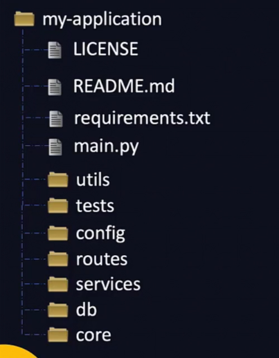

# VI Editor
Has 2 modes of operation
1. Command mode - copy/paste, delete, move
2. Insert mode - `i` to go to insert mode. `esc` to escape

```bash
# opening a file
vi <filename>

x # deletes a line
dd # delete entire line
yy # copy a line
p # paste
cntrl+u # scroll up
cntrl+d # scroll down

/<find something>
n # next result
u # undo
cntrl+r # redo
```

