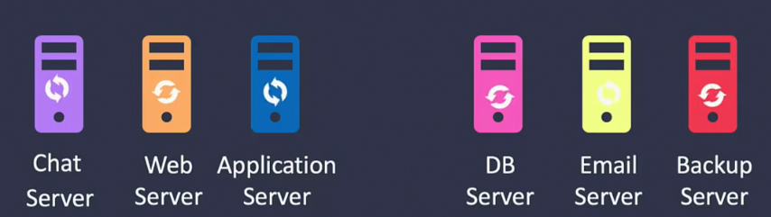

```bash
whoami
id #ids of users

su # switch user
su aparna
ssh aprna@192.168.1.2

# Downloading files
curl 
wget
wget https://www.w3.org/WAI/ER/tests/xhtml/testfiles/resources/pdf/dummy.pdf -O dummy.pdf

# check os version
ls /etc/*release*
cat /etc/*release*
```
- every linux system has a super user called the root user

# Package Managers
Package managers allow to install software on the linux system
- centos uses RPM package manager - red hat package manager
A software is packaged into a bundle with the extension `.rpm`
```bash
rpm -i telnet.rpm    # -i means install
rpm -e telnet.rpm   # uninstall
rpm -q telnet   # query
```
- RPM doesnt look for required dependancies of package which you are installing
- `YUM` queries the package, finds its location and install all dependancies as well as tje package itself
- `yum install ansible` installs ansible and all of its dependant packages

```bash
# to check if a package is installed
rpm -1 <package name>

yum list installed
sudo yum remove maven
sudo yum install maven-1:3.6.3-13.el9.noarch
```
# Services
Once software is installed on servers, we need to make sure those servers (services) are running and stay running even after the servers are rebooted.
- Also need to make sure they are started in the right order.

When any software which runs as a service in the background is installed i.e. web server or database server or Docker, they are automatically configured as a service on the system

```bash
service <service name> start
# or
systemctl start <service name>   # newer    

```
