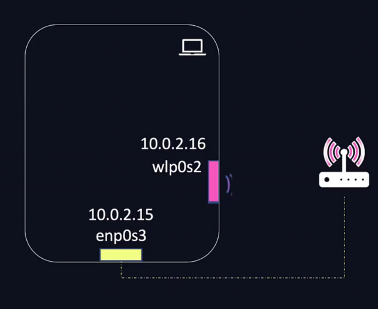

# Networking Basics

[Basics of IP Address & Subnetting Part 1](https://www.youtube.com/watch?v=5WfiTHiU4x8&list=PLIhvC56v63IKrRHh3gvZZBAGvsvOhwrRF)

- Every computer device has an IP Address (it's just like a phone number)
- IP Addresses also give the ability to connect to the internet
- To check current IP Address:
```bash
# windows
ipconfig

#linux
curl ifconfig.me

sudo apt-get install net-tools
ifconfig
```


## How did the device get its IP Address
- Whenever a device connects to a router (Opera), the router gives it an IP Address
- Each of the numbers below can be between 0 and 255


- Mostly ip addresses start with `192.168.1.***`
- The way that opera tells us that each IP address is going to start with `192.168.1.***` is through a `Subnet Mask` 
- Purpose of subnet mask is to tell what IP's in our network start with.
- Each of the 4 numbers which are seperated by decimals are called octets.
- If the octet of the subnet mask is 255, then the corresponding octet of the IP address will remain the same in the same network 
- So in the below image `192.168.1` will always remain the same. These 3 numbers are known as the network portion of the IP Address.
- 0 in the subnet mask means the corresponding octet in the IP address can be any number it wants. This number is known as the Host portion of the IP Address. So for the below image a total of `256 - 3 = 253` IP Addresses are possible.
- `192.168.1.0` is known as the network address. `192.168.1.255` is the broadcast address (it contacts with everyone). These 2 and the Router IP are reserved and cannot be used.


- The network portion remains the same because other devices are in the same neighbourhood. Network portion is the neighbourhood name, and host part is the house address.
- If an IP is in a different neighbourhood (different network portion) - for ex. accessing netflix.com , then the router (default gateway) will be used for this.
- So every device looks at `IP Address -> Subet Mask`. If the IP is not in the network, it contacts default gateway
So when we have devices in a network, they all are known as hosts in the network (only have different hosts in the network)

---
[Basics of IP Address & Subnetting Part II](https://www.youtube.com/watch?v=tcae4TSSMo8&list=PLIhvC56v63IKrRHh3gvZZBAGvsvOhwrRF&index=2)

- There are 4.3 Billion (`0-255 . 0-255 . 0-255 . 0-255  ~= 2^32`) possible IP Addresses, and all of them are run out. 
- There are 5 groups of IP addresses A to E
- Classes A, B and C each have their own default subnet mask (It determines how big the network is / which numbers in our IP address remain the same and which change)
- In class A only the first octet is static, rest can change - so overall 16 million IP addresses are possible in 1 network.
- Big companies have category A IP addresses - each has 16 million IP addresses (hosts) - There are only 126 class A networks.
- IANA is responsible for giving away IP addresses
- Big companies break it into smaller networks
- IP addresses which have subnet mask of `255.255.255.0` are called classless network.
- In class B 65k ip addresses are possible and 16k networks are possible.
- In class C 254 IP addresses are possible and 2M networks are possible.
```
Class C gives us the most networks and smaller number of hosts per network.
Class A gives us v high # of hosts per network but only 126 networks. 
```
- Class D and E networks are untouchable (reserved).


### Missing IP Addresses
- Between class A and B, there are 16 million IP addresses.
- These are known as loop back addresses and are used in our devices.
- `ping` means are you alive and awake?
```
Loopback addresses are special IP addresses used by a computer to refer to itself. The most common loopback address is 127.0.0.1, which is used for testing and troubleshooting network configurations. It allows a device to send and receive data to itself without accessing the network, ensuring the network stack is functioning correctly.
```
Our computer has 16 million IP addresses ready to respond to itself.
```
ping 127.0.0.1 
ping 127.145.145.8
```


---
## Private IP Addresses
[Basics of IP Address & Subnetting Part III](https://www.youtube.com/watch?v=8bhvn9tQk8o&list=PLIhvC56v63IKrRHh3gvZZBAGvsvOhwrRF&index=3)

- In 1996 we were about to run out of IP addresses, but this was solved by `RFC1918` (Private IP addresses)
- Class A, B and C of IP addresses are now referred to as public IP addresses - meaning IP addresses which can be reached on the internet.
- The internet can be thought of as a big network
- So to connect to the internet we need a public IP address but it needs to be unique.
### Private IP addresses


- Most common private IP addresses home routers use is class C ip address range.
- Private IP adresses dont connect to you to the internet (they are not publically routable on the internet - cant talk to them from the internet)
- NAT is responsible for connecting to the internet. 
### NAT
- NAT (Network address translation) is performed by the router.
- NAT is responsible for translating private IP address to a public one when it leaves the router
- The router assigns private IP addresses (not unique and millions can have the same)
- The ISP (internet service provider) gives 1 public IP address to the router.
- So every device in the home network, when it accesses anything on the internet, their identity is the same public IP address
`google what is my ip?`


- But we still run out of IPv addresses, and to solve that we came up with `IPv6` addresses.


- Every device which exists can have a public IPv6 address and connect to the internet.
- All phones connected via cellular networks have `IPv6` address.

---
## Decimal to Binary Conversion of IP Addresses
[Basics of IP Address & Subnetting Part IV](https://www.youtube.com/watch?v=2-i5x8KCfII&list=PLIhvC56v63IKrRHh3gvZZBAGvsvOhwrRF&index=4)

- bits is the bottom.


---

- 2 computers are connected via switches
- The switch connects 2 computers by connecting to interfaces of hosts on each of the computers
- To see interfaces of the host - `iplink`
- We assign all systems/computers with the 


# DNS