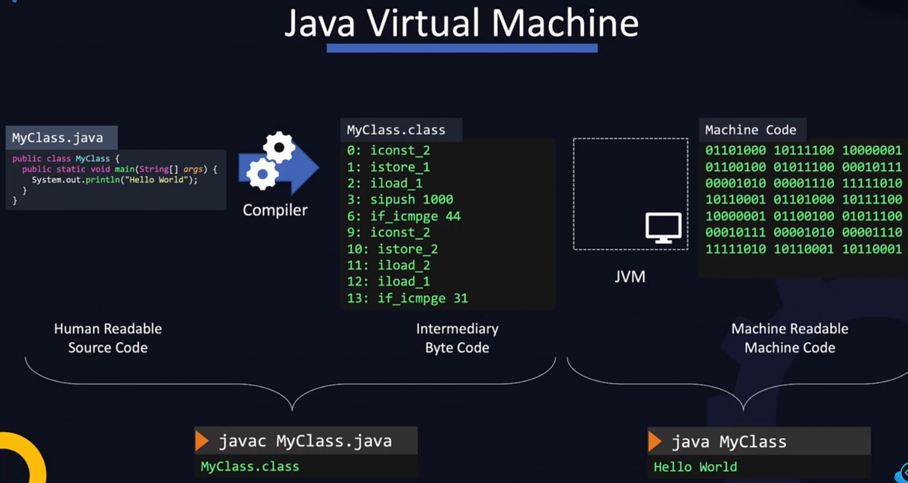

## Introduction
- Compiled languages such as Java, C, C++ are first developed then compiled and then executed.
- Interpreted languages are developed and then executed.
- A Compiled program only works on the platform it was designed for.

## Java
1. Source code is written in a `file.java` file
2. The code is compiled using `javac file.java` command
3. The file is run using `java file` command



- `JAR` is used to archive - compress and combine multiple java.class files into a single distributable package
- In case we have static files and images they all are packaged into a WAR file, which stands for web archive.

```bash
jar cf MyApp.jar MyClass.class Service1.class ...
```

- When this file is created it automatically creates a manifest file within the package called `META-INF/MANIFEST.MF`. This file contains information about the files packaged in the jar file and any other meta-data regarding the application.
- to run a java jar file:
```bash
java -jar myApp.jar

# generate documentation
javadoc -d doc MyClass.java
```

### Build Tools for Java
Common build tools for java:
1. Maven
2. Gradle
3. Ant

These tools use configuration files where you can specify the steps which we want to be automated.

## JavaScript
NodeJS took javascript out of the web browsers and on to the server side. NodeJS is a server side javascript environment that can be used to develop applications such as web servers using JavaScript.

NodeJS can handle a large number of concurrent connections by implementing non-blocking IO model.   

Running NodeJS code:
```javascript
node /home/add.js
```

- All nodejs packages are available at a public repo - `npmjs.com`
- NPM allows to develop new reusable packages and share them on the public repo. 

```javascript
npm -v

npm search file // search for a file

npm install [package name]
sudo npm install file -g // install globally
```