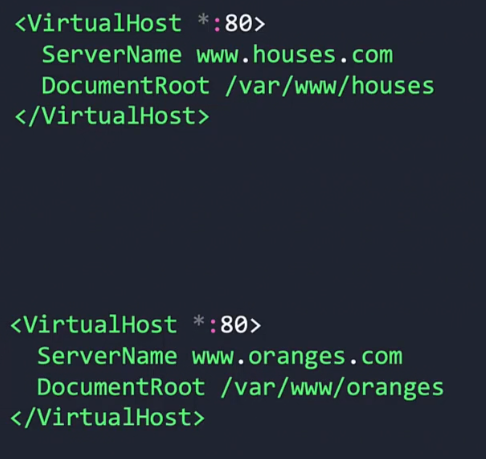
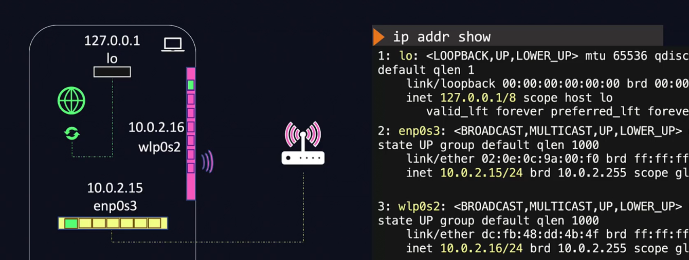

# Web Servers

Application can be classified as:
1. Standalone
    - Does not need to make external comminication
    - All logic is built inside the code
    - examples: desktop app of calculator.
2. Client-Server
    - An app which needs to communicate with a server to deliver the message

### Client Server Architecture
One server can have multiple clients from different sources (Web/Server/Mobile).

## Servers
All servers have programs which listen for incoming requests on a particular port. Any system could be a server.    

Types of servers


## Web Frameworks and Web Servers
Client sends a request to the server which returns a response. There are 2 sets of code:
1. Which runs on the server side (Backend code)
    - The code is listening for connections from the users
    - Running logic and querying the database
2. Which runs on the client side (Front end)
    - Display information
    - Runs on the user's browsers


A web framework helps in developing the application code, a web server is what hosts the application.

### Examples of Servers which can host web applications
Below are the application servers:
1. Apache Tomcat - `8080`
2. Nginx - `80`
3. gunicorn - `8000`

The web servers run one or more processes that listen on a particular port for a request, perform the required operations and provide the response back to the users.

Web servers can host multiple applications at the same time.

## Static vs Dynamic Websites
Static websites use static content which does not change i.e. no interaction with the server after the content is served.

Apache http web server and nginx can serve static content

Dynamic websites have a backend i.e. have logics running. They require both static and dynamic content.

Apache tomcat, uwsgi, and gunicorn are examples of application servers.

## Apache Web Server
Is an open source web server which can serve http, css and javascript files . It is used in conjunction with a application server which acts as a backend which run business logic.

```bash
# installing apache web server
yum install httpd

# start service
service httpd start

# verify
service httpd status

# may require edit firewall to allow httpd traffic
```

- Every server has a path which stores the logs - access and error logs
- Every server also has a configuration file
    - What port it listens on
    - Where the static content is stored
    - ssl or https configurations 
    - Where logs are stored etc.
    - Is in conf folder.
    - DocumentRoot defines the location where the static content is stored

- A single apache server can hosts mutiple websites
- To do this the files and configurations of each website is configured a virtual host within the apache configuration file..
- The `VirtualHost` is a logical division of the apache web server. Each virtual host can be configured with its own server name and document root.




## Apache Tomcat
The apache tomcat server provides a web server environment that can host `java` based web applications. For this we must have java installed.


- `.bat` files are used for windows. `.sh` for linux.

Downloading Tomcat

```
sudo wget https://downloads.apache.org/tomcat/tomcat-11/

https://downloads.apache.org/tomcat/tomcat-11/v11.0.0-M26/bin/apache-tomcat-11.0.0-M26-deployer.tar.gz

sudo tar -xvf apache-tomcat-11*.tar.gz

sudo mv apache-tomcat-11.0.0-M26-deployer /opt/apache-tomcat-11

#start
sudo /opt/apache-tomcat-11/bin/startup.sh
```

## Flask
Flask is a python web framework. Below is a sample structure of a python project.


tools used to deploy flask in production are:
1. gunicorn
2. uWSGI
3. gevent
4. twisted web

Changing port

```bash
sudo sed -i 's/8080/5000/g' app.py

```

gunicorn

```
gunicorn -w 4 -b 0.0.0.0:8000 app:app

ps -ef | grep gunicorn | grep -v grep
```

## IPs and Ports
- computers have wired and wireless interfaces which they use to connect to networks.
- After connecting to a network they get ip addresses. an ip address is assigned to an interface.
- A computer can have multiple ip addresses if it connects to the same network using wired and wireless.
```
ip addr show
```


- Each of the network interfaces is split into logical components known as ports.
- We can have 65k+ ports on a single ip address.
- Each port is a communication end point.
- Programs can listen on these ports for requests.

When we run a web server it listens on these ports. We can also specify the ip address on which the server listens on using the host option.


```python
app.run(port=8000, host='0.0.0.0')
```

If we dont want any one to access the application, we can not specify the host argument. Doing so the app does not listen on any interface.

So when no option is specified the server listens on ip 127.0.0.1 by default. This is known as the loop-back address - it is also known as `localhost`. Every host has a built-in virtual interface known as the loop back address. It is also visible in `ip addr show`. It is like referring to itself. anything sent to it is sent to the same host i.e. nothing leaves the host system.



#### Exercises
Run apache tomcat on all IP interfaces and port 9090 on host01 server.


```
SSH to app01 server if you are in the host01 server from the thor user. It's a passwordless setup: -

thor@host01 ~$ ssh app01


Skip this step. if you are already in the app01 server.


Replace the given IP address and port with sed command as follows: -

[thor@app01 ~]$ sudo sed -i 's/0.0.0.0/127.0.0.1/g;s/8080/5000/g' /opt/simple-webapp-flask/app.py


And inspect the changes: -

[thor@app01 ~]$ cat /opt/simple-webapp-flask/app.py 


Now, move to the /opt/simple-webapp-flask/ directory: -

[thor@app01 ~]$ cd /opt/simple-webapp-flask/


Then run the python app in background with nohup as follows: -

[thor@app01 simple-webapp-flask]$ nohup python3 app.py &


To ensure it's working, make use of the curl command: -

[thor@app01 simple-webapp-flask]$ curl http://127.0.0.1:5000
```