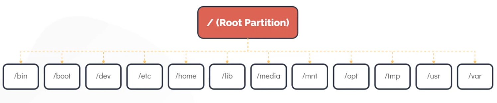

## Core Concepts
Kernel is the interface between the computer's hardware and its processes.
It communicates between 2 managing resources.

The kernel is responsible for  major tasks
1. Memory management
2. Process management
3. Device drivers
4. Systems calls and security

Linux kernel is monolithic i.e. carries out processes by itself. It is also modular

```bash
uname # display info on kernel
uname -r # display kernel version
uname -a
```

Memory is divided into 2 areas:
1. Kernel space
2. User space

Kernel space is the portion of the memory in which the kernel executes and provides its services. A process running in the kernel space has unrestricted access to the hardware.

All Processes running outside the kernel reside in the user space which has restricted access to CPU and memory.

Most unix-like operating systems come pre-packaged with all kinds of utilities such as programming languages and GUI etc. These are user-space applications.

## Working with Hardware
- When a device is attached to a system, the device driver which is part of the kernel space detects state change and generates an event (`uevent`) is sent to the user space device manager deamon called `udev`.
- The udev service is responsible for dynamically creating a device node associated with the newly attached drive in the `/dev` file system.
- Once this process is complete the newly attached disk should be visible under `/dev/` file system.
- The `lsblk` command in Linux is used to list information about all available block devices on your system. Block devices include storage devices like hard drives, SSDs, USB drives, and their associated partitions. 

```bash
dmesg # used to display messages generated by kernel
udevadm monitor # will get message if any device attached.
```

## Linux Boot Sequence
The Boot process can be broken down into 4 stages:
1. BIOS post
2. Boot Loader (grub2)
3. Kernel Initialization
4. Service initialization using systemd

- post means power on self test
- The boot loader boots the kernel into memory, supplies it with some parameters and hands over the control to the kernel.
- In the 3rd phase, kernel is decompressed. It is then loaded into the memory and starts executing.

## Run Levels
Linux has several modes of operations. These modes are set using runlevels

```bash
runlevel # see current operational mode
systemctl get-default
```

## File Types
Every type of object in linux can be considered as a type of a file.
There are 3 types of files in linux:
1. Regular File
2. Directory
3. Special Files

To check file type:
```bash
file [file name]
```

## File System Heirarchy

- `/home` contains home directories for all users except the root user.
- Root users home directory is located at `/root`
- Third party programs are installed in `/opt`
- `/tmp` is to store temperory data
- `/mnt` mount file systems temperoralily in the system
- `/dev` contains file for special devices such as mouse and keyboard
- built in programs are in `/bin` (binary)
- `/etc` is used to store configuration files in linux
- `/lib` is for shared libraries which are to be loaded into programs
- `/usr` where userland applications and data reside
- `/var` logs are stored here

```bash
df -hP # prints details of all mounted file systems
```

The `sudo lshw` command in Linux is used to display detailed information about the hardware configuration of the system. The lshw (List Hardware) tool provides a comprehensive report on various components of the hardware, such as the CPU, memory, storage devices, network interfaces, and more.