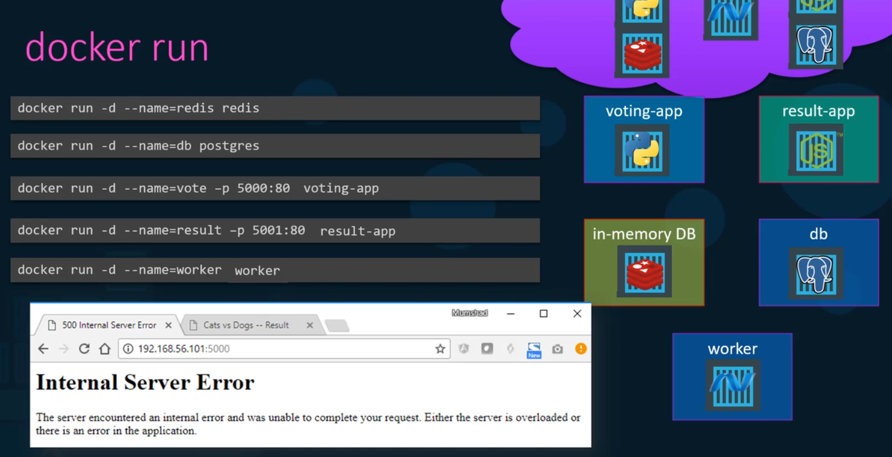
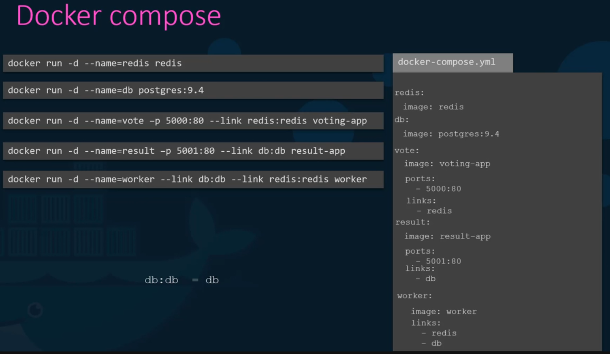
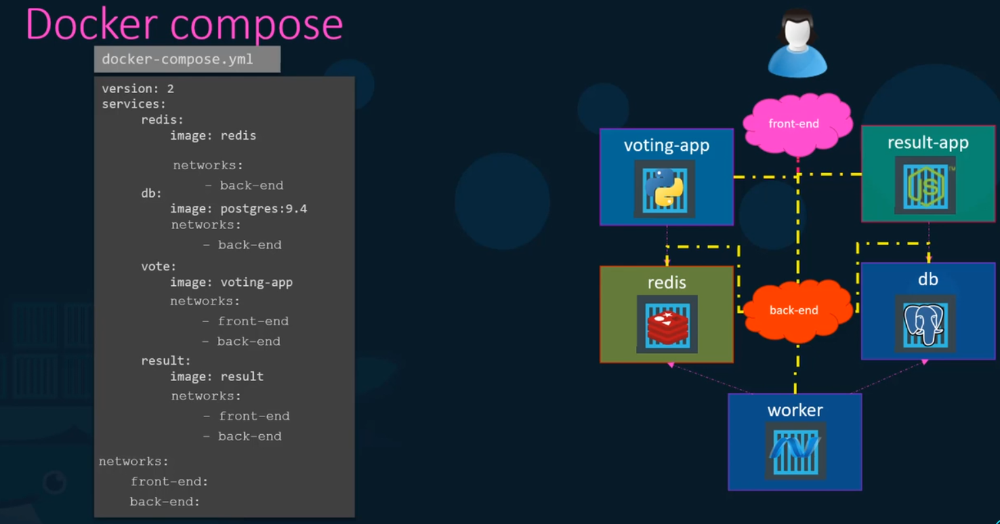
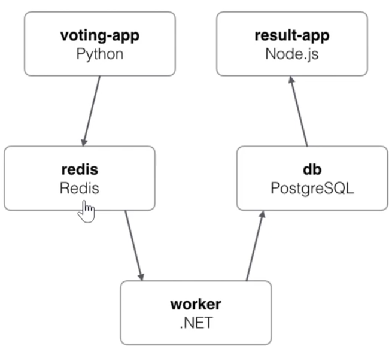

We can create a configuration file in `yml` and put together the services.
- Docker compose up to bring up the entire application stack
- All changes are stored in the configuration file
- But this is only applicable for running containers on a single docker host.



Need to link the containers - so that they can communicate with each other.
### Links
Links is a command line option which can be used to link 2 containers together
Links are deprecated, so not going in its detail.

## Creating a Docker Compose file
- Keys are the name of the containers
- Under each we specify which image to use (key is image and the value is which image to use)



- In version 2 of docker compose, it automatically creates a dedicated bridged network and attaches all containers to that new network.
- All containers are then able to communicate with each other using each other's service name.
- We can also specify a depends-on feature. A dependant container will start first before the other one.
- Version 3 introduces support for docker swarm.
- Specifying different networks:
- ports host:app  web servers have port requirements



## Demo - Voting Application on Docker Compose



```bash
git clone https://github.com/dockersamples/example-voting-app.git

cd example-voting-app
cd vote
docker build . -t voting-app
docker run -p 5000:80 voting-app

docker run -d --name=redis redis
docker run -d -p 5000:80 --link redis:redis voting-app
docker run -d -e POSTGRES_HOST_AUTH_METHOD=trust --name=db postgres:9.4

cd ..
cd worker
docker build . -t worker-app
docker run --link redis:redis --link db:db worker-app

cd ..
cd result
docker build . -t result-app

docker images
docker run -p 5001:80 --link db:db result-app
```

