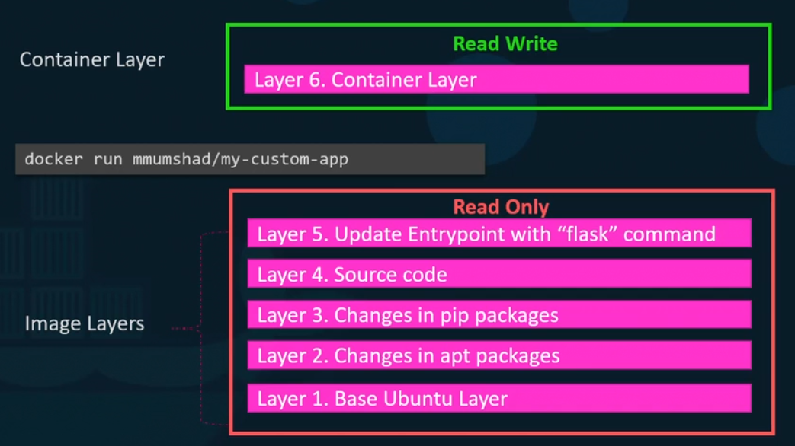
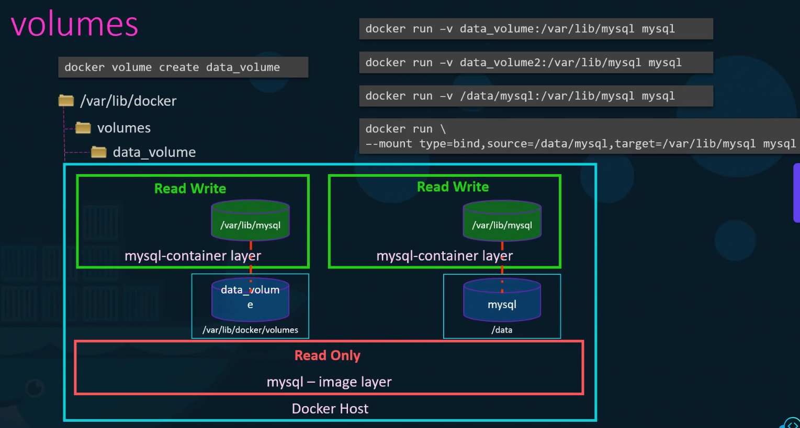

# Docker Engine

Docker engine means the host with docker installed on it.

When we install docker on a linux host, we are installing 3 components:
1. Docker CLI
2. REST API
3. Docker deamon

The docker deamon is a background process which manages docker objects such as images, containers, volumes and networks. The docker rest api server is the api interface that programs can use to talk to the deamon and provide instructions.

The CLI is where we write commands such as docker run. It uses REST API to interact with the docker deamon.

The docker cli can work with a remote docker engine.

Docker uses cgroups to control the amount of hardware resources allocated to each container

### File System in Docker
How docker stores data on the local file system?

When we install docker on a system, it creates a folder structure `/var/lib/docker`

### Docker's Layered Architecture
When docker builds images, it builds these in a layered architecture.

Each line of instruction in the dockerfile creates a new layer in the docker image with just the changes from the previous layer.



The life of layer 6 is as long as the container is alive. Files in the image layer are read only and cannot be edited.

### Copy on write mechanism
If a file in the image layer is to be edited, its copy is first made in the read layer and that is edited. The code is part of the image layer and is read only.
- The same image layer may be shared between multiple containers created from this image.
- To modify the file in the image layer it is copied onto the Read Write Layer and that version is modified.
- Since the files in the image layers are not modified, the image remains the same all the time until it is rebuilt using the docker build command.
- When a container is deleted, all of the data stored in the container layer also gets deleted. 

## Volumes
To preserve the data created by the container (read layer), we add a persistant volume to the container. We create a docker volume.

### Creating a volume
- Volumes are created under the `var/lib/docker/volumes` folder. docker is replaced by the container name.
- The second command is used to run the docker container. The volume is mounted inside the docker container's read write layer using the -v option
```bash
docker volume create data_volume # It creates a folder named data_volume

docker run -v data_volume:/var/lib/mysql mysql
```
- This will create a new layer and mount the data volume we created into `var/lib/mysql` folder inside the container. All data written by the database is stored on the volume created on the docker host.
- Even if the container is destroyed, the data is still active
- We can run the 2nd command directly, it will automatically create a volume and mount it to the container.
- If we had external storage on the docker host at some location we need to provide the entire folder path. It will create a folder and mount the folder to the container.
```bash
docker run -v /data/mysql:var/lib/mysql mysql
```
- This is bind mounting, the above one was volume mounting.
- Volume mount mounts the volume from the volumes directory and bind mount mounts a directory from any location on the docker host.
- `-v` is the old style, the new way is the `--mount`.



- Docker uses storage drivers to enable layered architectures.

----
#### Question
Run a mysql container named mysql-db using the mysql image. Set database password to db_pass123
```
docker run --name=mysql-db -d -e MYSQL_ROOT_PASSWORD=db_pass123 mysql
```

Run a mysql container again, but this time map a volume to the container so that the data stored by the container is stored at /opt/data on the host.

Use the same name : mysql-db and same password: db_pass123 as before. Mysql stores data at /var/lib/mysql inside the container.

```bash
docker run -v /opt/data:/var/lib/mysql -d --name mysql-db -e MYSQL_ROOT_PASSWORD=db_pass123 mysql
```
