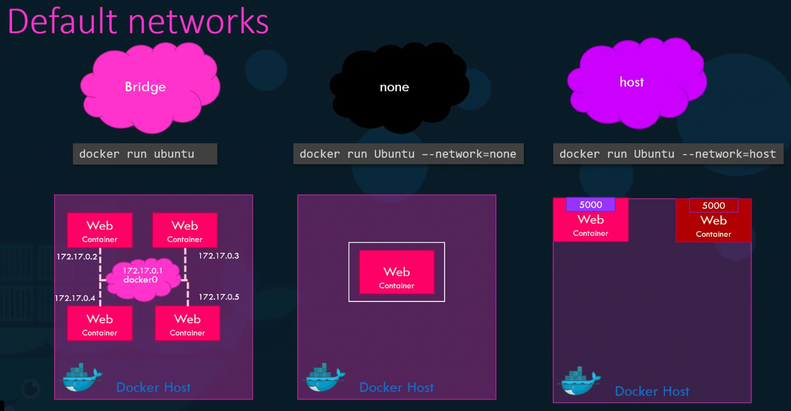

# Docker Networking
When we install docker, it creates 3 networks automatically
1. Bridge
2. None
3. Host

Bridge is the default network a container gets attached to. If we need to associate a container with any other network, we specify the network information using the network command line param `--network`

## Bridge Network
The bridge network is a private internal network created by Docker on the host. All containers attached to this network by default and they get an internal IP address in the range of `172.17` series. They containers can access each other using this internal IP if required.

To access any of these containers from the outside world, we map the ports of these containers to the ports of the docker host.

Another way to access the containers externally is to associate the container to the host network,

## Host Network
This takes out any network isolation between the docker host and the docker container. This means if we were to run the web server on port 5000 in a web app container, It is automatically accessible on the same port externally without requiring any port mapping as the web container uses the hosts network.

This also means unlike before we will now not be able to run multiple web containers on the same host on the same port. As the ports are now common to all containers in the host network.

## None network
With the none network, the containers are not attached to any network and does not have any access to the external network or other containers. They run in an isolated network

# User defined Networks

# Inspect Network