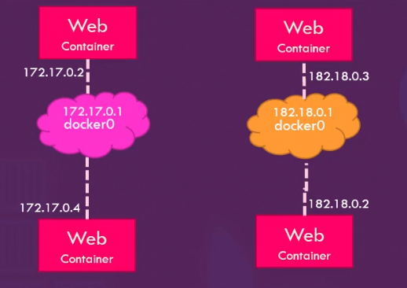
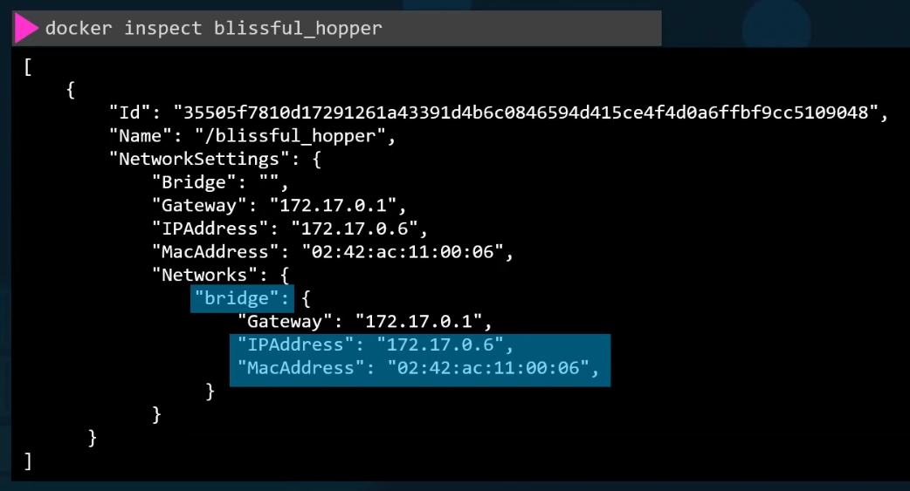

# Docker Networking
When we install docker, it creates 3 networks automatically
1. Bridge
2. None
3. Host

Bridge is the default network a container gets attached to. If we need to associate a container with any other network, we specify the network information using the network command line param `--network`


## Bridge Network
The bridge network is a private internal network created by Docker on the host. All containers attached to this network by default and they get an internal IP address in the range of `172.17` series. They containers can access each other using this internal IP if required.

To access any of these containers from the outside world, we map the ports of these containers to the ports of the docker host.

Another way to access the containers externally is to associate the container to the host network,

## Host Network
This takes out any network isolation between the docker host and the docker container. This means if we were to run the web server on port 5000 in a web app container, It is automatically accessible on the same port externally without requiring any port mapping as the web container uses the hosts network.

This also means unlike before we will now not be able to run multiple web containers on the same host on the same port. As the ports are now common to all containers in the host network.

## None network
With the none network, the containers are not attached to any network and does not have any access to the external network or other containers. They run in an isolated network

# User defined Networks
By default, docker only creates 1 internal bridge network.

If we wish to isolate the containers within the docker host. For eg. if we want 2 containers to be on a seperate internal network, and others to be on a seperate internal network. We would need to create our own internal network. We do that using the command:
```bash
docker network create \
    --driver bridge \
    --subnet 182.18.0.0/16
    custom-isolated-network
```

To list all networks
```bash
docker network ls
```



# Inspect Network
To see the network settings and the ip address assigned to an existing container

```bash
docker inspect [id /  name of container]
```

- By doing this we will find a section on network settings.


# Embedded DNS
Containers can connect to each other using their names. It has a built in DNS server that helps the containers resolve each other using the container name. Note that the built-in DNS server always runs at 127.0.0.11

# Practice
We just ran a container named alpine-1. Identify the network it is attached to.
```bash
docker inspect alpine-1
```


Run a container named alpine-2 using the alpine images/image and attach it to the none network.
```bash
docker run --name alpine-2 --network=none alpine
```

Deploy a mysql database using the mysql:5.6 images/image and name it mysql-db. Attach it to the newly created network wp-mysql-network

Set the database password to use db_pass123. The environment variable to set is MYSQL_ROOT_PASSWORD.

```
docker run -d -e MYSQL_ROOT_PASSWORD=db_pass123 --name mysql-db --network wp-mysql-network mysql:5.6
```
Deploy a web application named webapp using the kodekloud/simple-webapp-mysql images/image. Expose the port to 38080 on the host.

The application makes use of two environment variable:
1: DB_Host with the value mysql-db.
2: DB_Password with the value db_pass123.
Make sure to attach it to the newly created network called wp-mysql-network.

Also make sure to link the MySQL and the webapp container.

```
docker run --network=wp-mysql-network -e DB_Host=mysql-db -e DB_Password=db_pass123 -p 38080:8080 --name webapp --link mysql-db:mysql-db -d kodekloud/simple-webapp-mysql
```