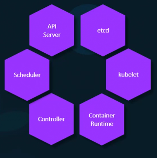

# Container Orchestration

With docker we can run a single instance of the application with a simple docker run command. But if we run multiple instances we would need to:
- Manually execute `docker run` command if more containers required i.e. deploy additional instances ourselves.
- Keep a watch on load, performance and health of the application.
- If a container fails, we need to detect it and deploy another container again.
- Also keep in check health of docker host, if that fails all containers fail.

Monitor:
```
State-Performance-Health
```

### Orchestration
Is a set of tools and scripts that can help host containers in a production environment. It consists of multiple docker hosts that can host containers. This means even if one fails the application is still accessible through the others
### Kubernetes
In kubernetes we have kubernetes CLI which is known as kube control. from this we can run multiple instances of the application using a single command.

A kubernetes cluster consists of a set of nodes. A node is a machine physical/virtual. It is a worker machine where containers are launched. We have more than 1 nodes. A cluster is a set of nodes grouped together.

The cluster is managed using a master node. The master is a node with the kubernetes control pane components installed. The master watches over the nodes in the cluster and is responsible for orchestration. 

Installing kubernetes means installing the following components:


