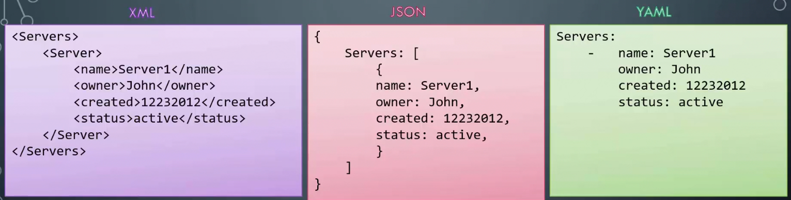
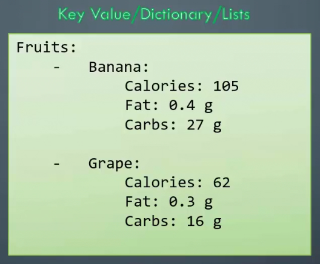
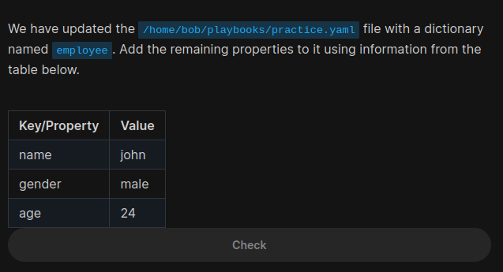
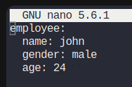
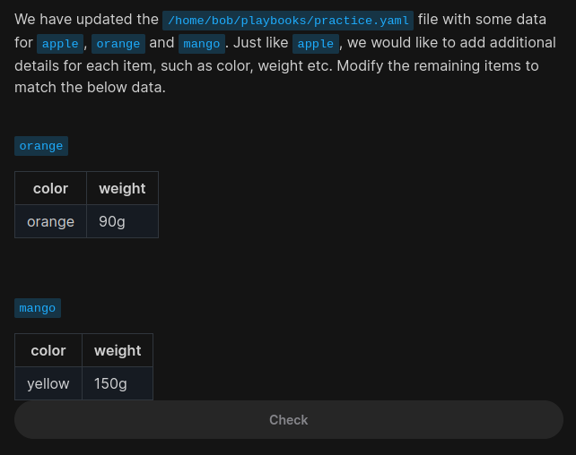
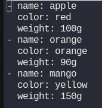
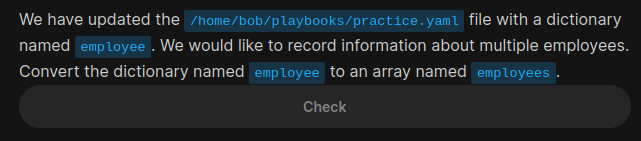
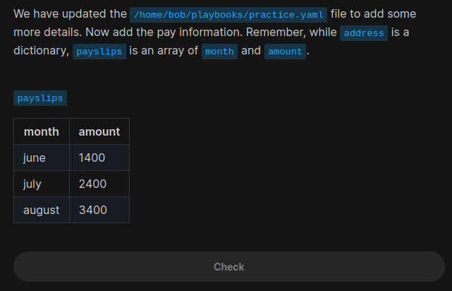
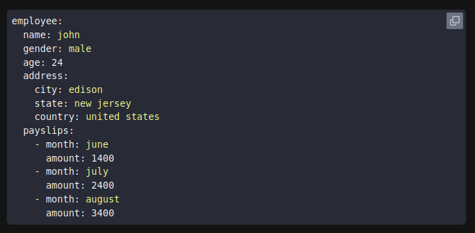

# YAML

YAML file is used to represent configuration data.



```yaml
key: value
```



This is a list of fruits and the elements are bananas and grapes, but each of these elements are dictiories





The one which starts with `-` is an array.







```yaml
employees:
  - name: john
    gender: male
    age: 24
```




