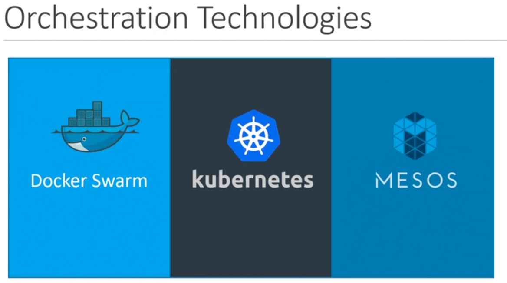
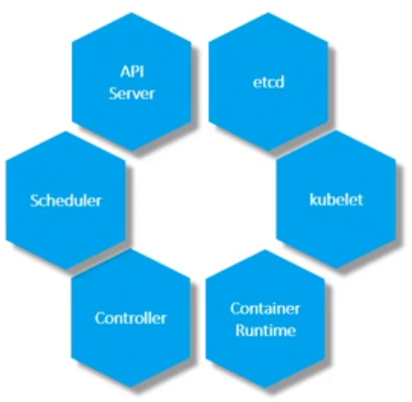
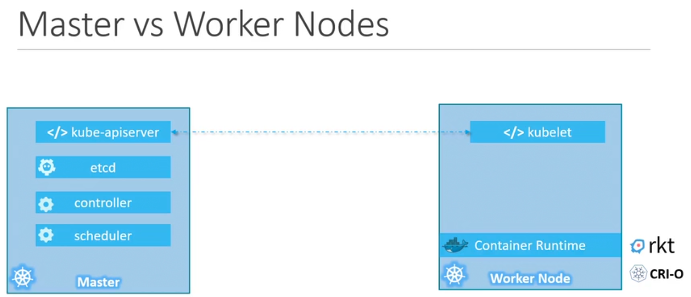

# Overview
Is the go to platform for hosting production-grade applications. Kubernetes is also known as K8s.



## Kubernetes Architecture
A node is a machine physical/virtual on which kubernetes is installed. A node is a worker machine and that is where containers will be launched. A cluster is a set of nodes grouped together. Having multiple nodes helps in sharing load. The master node is responsible for managing the cluster. The master watches over the nodes in a cluster and is responsible for actual orchestration of the contaiers on the worker nodes.

Installing kubernetes means installing the following components:



1. **API Server:** Is the front-end of kubernetes
2. **ETCD:** Distributed key value store, used to store all data used to store all data used to manage the cluster. Also stores logs.
3. **Scheduler:** Responsible for distributing the work or containers across multiple nodes. It assigns containers to nodes.
4. **Controllers** are the brain behind orchestration. They are responsible for noticing and responding when a node/containers/end-points go down. Controller makes decisions to bring up new containers in such cases.
5. **Container run-time:** Is the underlying software used to run containers which is docker in our case.
6. **Kubelet:** Is the agent that runs that runs on each node in the cluster. Agent is responsible for making sure that the containers are running on the nodes as expected.


There ae 2 types of nodes:
1. Worker Node 
2. Master Node

- Worker nodes have the `kubelet` agent that is responsible for interacting with the master to provide health info and carry out actions requested by the master on the worker nodes.
- Master nodes `Kube api server` installed which is responsible for interacting with the user. `ETCD` is also installed on the master. Controller and Scheduler are also installed on the master.



### Kubectl
Used to deploy and manage applications on a kubernetes cluster.

Deploy an application on the cluster
```bash
kubectl run hello-minikube
```

View info on the cluster
```bash
kubectl cluster-info
```

Get all nodes which are part of a cluster
```bash
kubectl get nodes
```

Look at the Operating System.
```bash
kubectl get nodes -o wide
```

## Containerd
Containerd is a container runtime used to manage the entire lifecycle of containers, including downloading images, starting, stopping, and deleting containers. It provides a simple, reliable, and efficient way to run containers and is often used as an underlying component in container orchestration platforms like Kubernetes. 

Containerd is an essential part of Docker, acting as the core container runtime engine.

