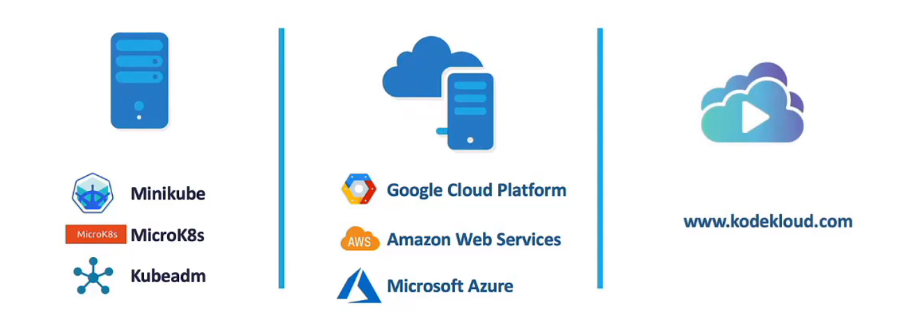

# Minikube

Purpose: Minikube is designed to create a single-node Kubernetes cluster for local development and testing. It runs Kubernetes clusters locally on your machine using virtual machines or containers.

Minikube bundles all components into a single docker images/image providing a pre-configured single node kubernetes cluster.