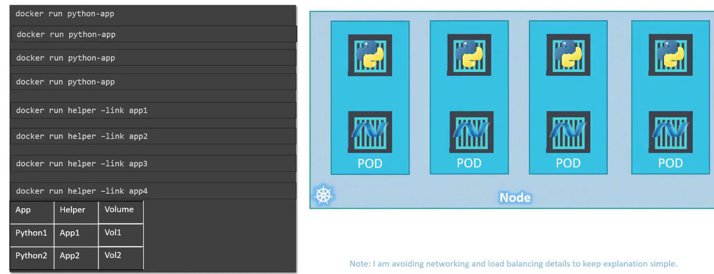

# Pods
Pod is the smallest unit in kubernetes.

Kubernetes does not deploy containers directly on the worker nodes. The containers are encapsulated into a kubernetes object known as pods. A pod is a single instance of an application. A pod is the smallest object that you can create in kubernetes

Container instances are spinned up inside a new pod. Inside a single pod there is a single instance of the application running. Pods have a 1:1 relation with containers running the application. To scale up we create new pods and to scale down you delete pods. We donot add additional containers to existing pods to scale the application.

We are not restricted to having a single container in a single pod. A single pod can have multiple containers but they must be of different kinds. Both can communicate with each other by referring to each other as localhost since they share the same network space.



Kubernetes does all of this for us automatically.
But multi-container pods is a rare case.

## Deploying Pods
Deploying a docker container by creating a pod
```bash
kubectl run nginx
kubectl run <pod-name> # pod name can be anything

kubectl run nginx --images/image nginx # which images/image to use
```
It creates a pod automatically and deployes an instance of the nginx docker images/image.
-  The images/image is downloaded from the docker hub repo.

---
To see list of pods in the cluster
```bash
kubectl get pods

kubectl describe pods
kubectl get pods -o wide # node where the pod is running and ip address of pod also

kubectl delete pod webapp
```