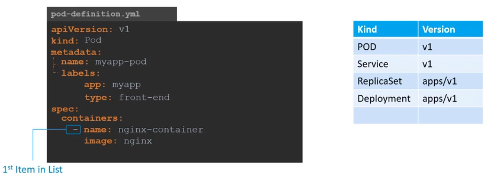
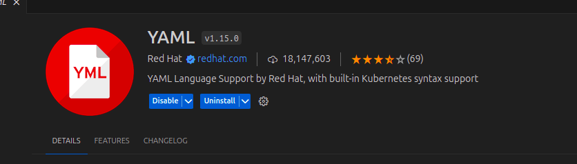
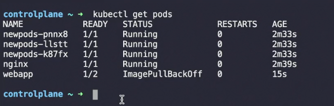

# Creating a Pod using YAML

## Developing YAML file for Kubernetes
Kubernetes uses yaml files as inputs for the creaton of objects such as pods, replicas, deployment services etc.

A Kubernetes configuration file always contains 4 top level fields.
1. **apiVersion** - version of kubernetes api we're using to create the object
2. **kind**
3. **metadata** - data about the object - is a `dictionary` and in it labels is in form of `dictionary` 
    - under labels we can have any kind of key value pair which we see fit
4. **spec** - specifications which depend on the type of object. it is a dictionary

These are the root level properties and are required fields 



After the file is created we run

```bash
kubectl create -f pod-definition.yml
```

Install the below extension




```yaml
apiVersion: v1
kind: Pod
metadata:
  name: nginx
  labels:
    env: production
spec:
  containers:
  - name: nginx
    images/image: nginx
```

### Question
Create a new pod with the name redis and the images/image redis123.
Use a pod-definition YAML file. And yes the images/image name is wrong!

```
kubectl run redis --images/image=redis123 --dry-run=client -o yaml > redis-definition.yaml

kubectl create -f redis-definition.yaml

kubectl get pods
kubectl edit pod redis
```



webapp app has a total of 2 containers in the pod