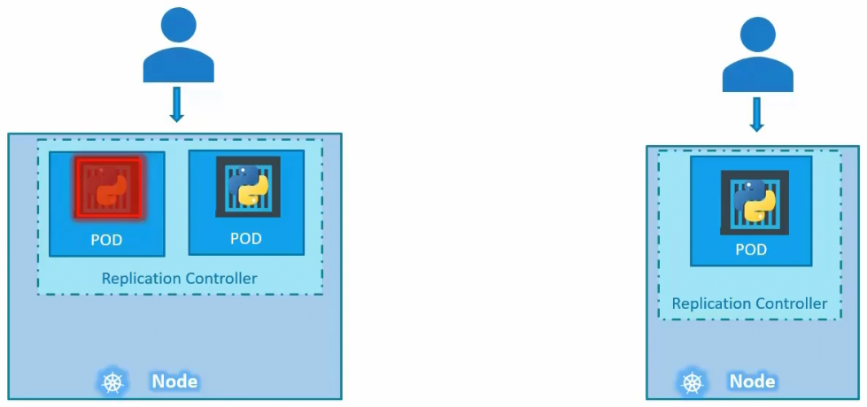
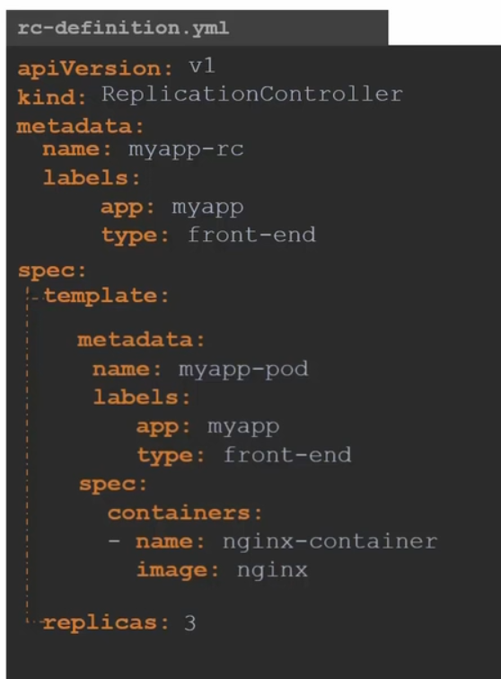

# Replication Controllers

- Controller are the brain behind kubernetes. They are the processes that monitor objects and respond accordingly.
- There are many types of controllers. One of which is the Replication controller. Replica set is the newer technolagy then replication controller with minor differences.

## Purpose
- Replication controller helps us in running multiple instances of a single pod in the kubernetes cluster providing **High Availability**. 
- **Load Balancing and Scaling:** we can deploy additional pods accross the other nodes in the cluster, when the demand increases.

Replication controller can:
1. To make more than one instance of pod running at the same time 
2. Replace the single pod when the existing one fails

```
It basically ensures a specified number of pods are running at all times
```



### Creating a Replication Controller
- To create a replication controller, we create a `rc-definition.yml` file.
- Like every yml file it has:
    1. apiVersion
    2. kind
    3. metadat
    4. spec

After creating the file, run:

```
kubectl create -f rc-definition.yml
```



To view the list of created replication controllers:

```
kubectl get replicationcontroller
kibectl get pods
```

### Replica Set

- For this we create `replicaset-definition.yml`
- It is same as replication controller but also requires a `selector` definition.
- It tells what pods lie under it. It is not a required field. by default assumes the same.
- replica set can also manage pods that were not created as part of the replica set creation.

```
kubectl create -f replicaset-definition.yml
kubectl get replicaset
kubectl get pods
```

## Labels and Selectors
The role of the replicaset is to monitor the pods and if any fails, it deploys new ones. It is a process which monitors the pods.

There could be 100s of other pods running in clusters - Labelling helps replicaset by telling it which pods to monitor.

## Lab
1. How many PODS exist on the system
```
kubectl get pods
```

2. How many Replicasets exist on the system
```
kubectl get replicaset
```