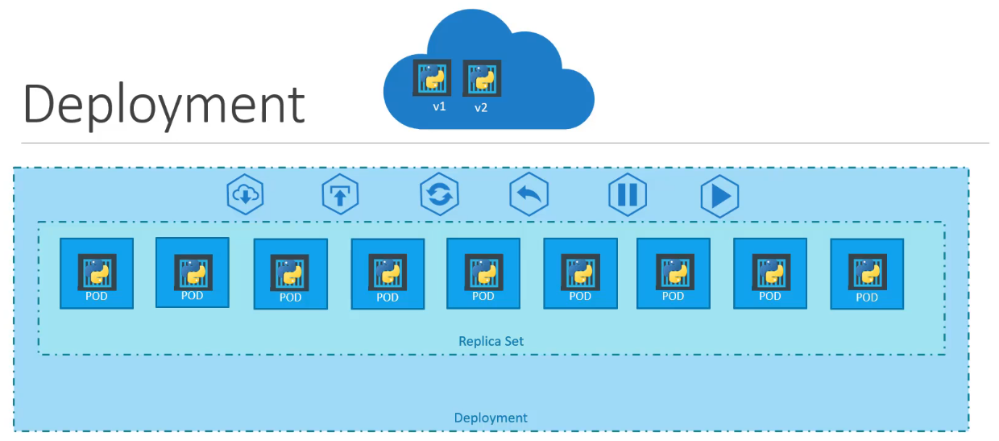
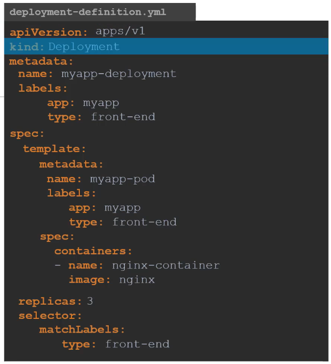
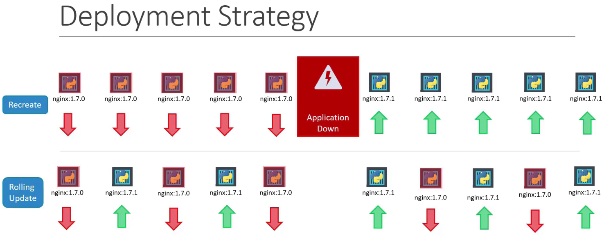
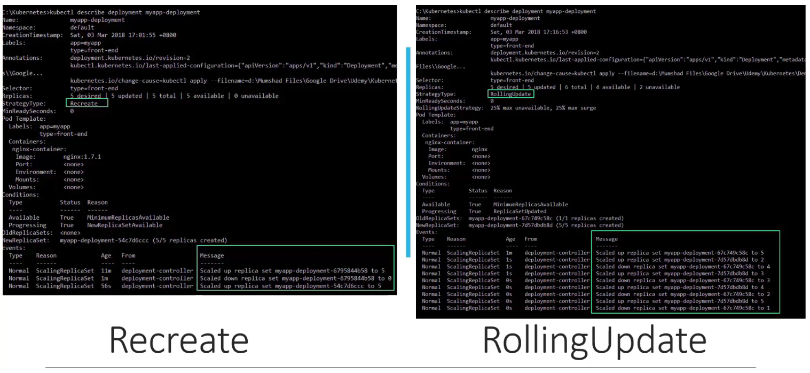
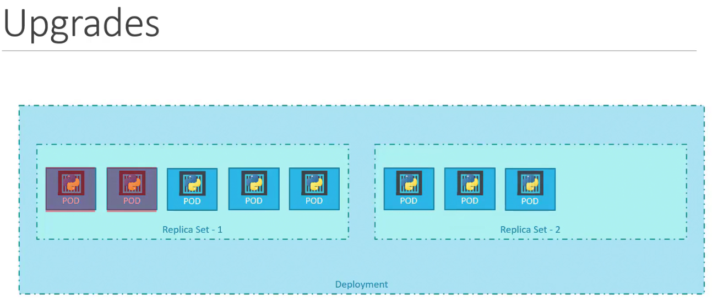
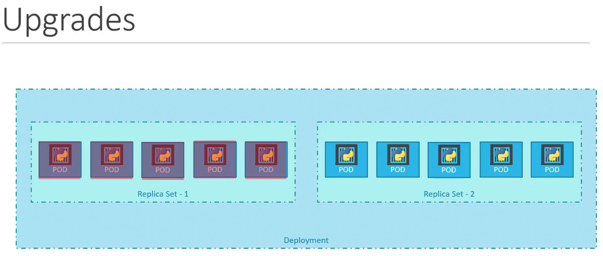
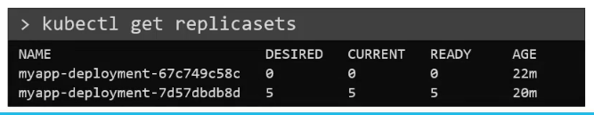
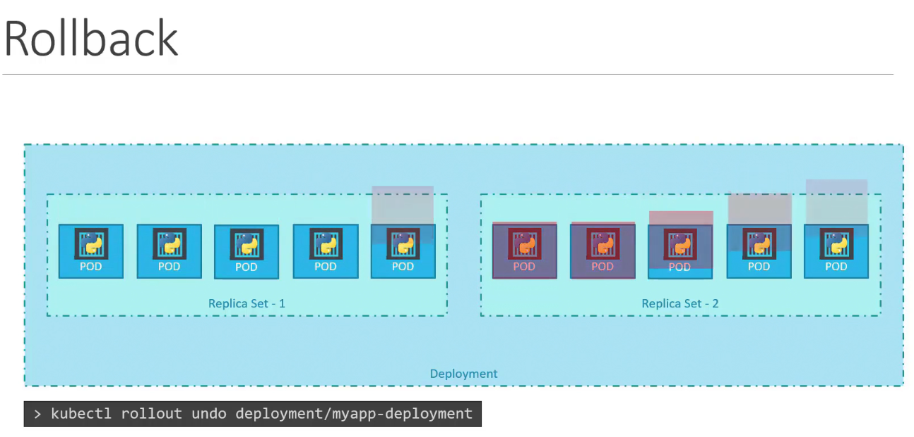
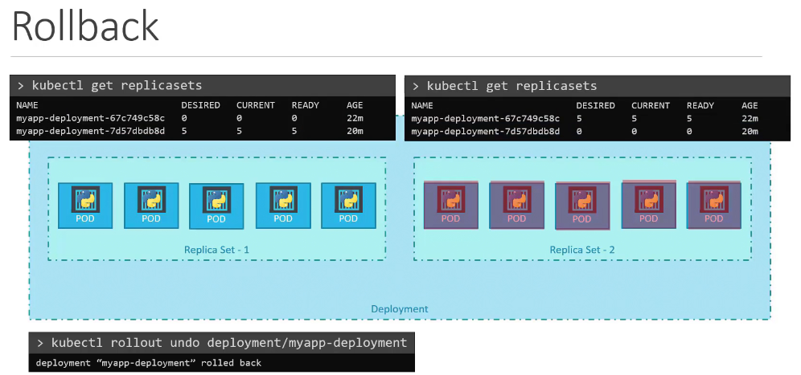

# Kubernetes Deployments

- When newer versions of the applications get available on the docker registry we need to upgrade our docker instances one at a time (rolling updates)
- multiple pods are deployed using replication controllers / replicasets
- Deployment is higher in the heirarchy then relpicasets
- Deployment provides us with the capability



## Creating Deployment
Deployment is created using `deployment-definition.yml` file. The components are similar to the replica-set definition file.

```
Deployment manages the lifecycle of a ReplicaSet by automatically creating, scaling, and updating it. The ReplicaSet ensures the specified number of pod replicas are running at any given time.
```



After this run:
```bash
kubectl create -f deployemnt-definition.yml
kubectl get deployments
kubectl get replicaset --to see all created objects
kubectl describe deployment <deployment-name>
kubectl explain deployment | head -n3
```
## Lab
Create a new Deployment with the below attributes using your own deployment definition file.

Name: httpd-frontend;
Replicas: 3;
Image: httpd:2.4-alpine
```yaml
apiVersion: apps/v1
kind: Deployment
metadata:
  name: httpd-frontend  # Name of the deployment
spec:
  replicas: 3  # Number of replicas
  selector:
    matchLabels:
      app: httpd-frontend
  template:
    metadata:
      labels:
        app: httpd-frontend
    spec:
      containers:
      - name: httpd  # Container name
        images/image: httpd:2.4-alpine  # Image used in the container
        ports:
        - containerPort: 80  # Port that the container exposes
```

## Updates and Rollback

When we first create a deployment, it triggers a rollout. A new rollout crates a new deployment revision.

When the application is upgraded i.e. when the container version is updgraded to a new one, then a new rollout is triggered and a new deployment revision is created named revision 2.

Revision allow is to rollback to a previous version of deployment if necessary.

Checking status of rollout
```
kubectl rollout status deployment/myapp-deployment
```

Checking revisions and history of rollouts
```
kubectl rollout history deployment/<deployment-name>
```

## Types of Deployment Strategies
Types:
1. Destroy all existing pods and then deploy new instances - Recreate Strategy - not used
2. Take down one and create new one by one - default - Rolling update



Updating / applying changes
```bash
kubectl apply -f deployment-definition.yml
```



When a new deployment is made to lets say deploy 5 replicas, it first creates a replicaset automatically which in turn creates the number of pods required to meet the number of replicas.

When we upgrade our application, the kubernetes deployment object creates a new replicaset under the hood and starts deploying the containers there. At the same time taking down the pods in the old replica set following a rolling update strategy.







### Rollback

If something is wrong with the new version of the build, we would need to rollback the update. Kubernetes deployments allows to rollback to a previous revision. It destorys the pods in the new replicaset and brings the older ones up in the old replicaset. The application is now back to the older format.





# Summary

### Create:
To create deployments
```
    kubectl create -f deployment-definition.yml
```
### Get:
List the deployments
```
    kubectl get deployments
```
### Update:

```
    kubectl apply -f deployment-definition.yml
    kubectl set images/image deployment/myapp-deployment nginx=nginx:1.9.1
```
### Status:
To see status of rollouts
```
    kubectl rollout status deployment/myapp-deployment
    kubectl rollout history deployment/myapp-deployment
```
### Rollback:
To rollback a deployment operation
```
    kubectl rollout undo deployment/myapp-deployment
```

## Labs
Run the script named curl-test.sh to send multiple requests to test the web application. Take a note of the output. Execute the script at /root/curl-test.sh.

```
chmod +x /root/curl-test.sh
/root/curl-test.sh

```

Inspect the deployment and identify the number of PODs deployed by it
```
kubectl get deployments
kubectl describe deployment frontend
```