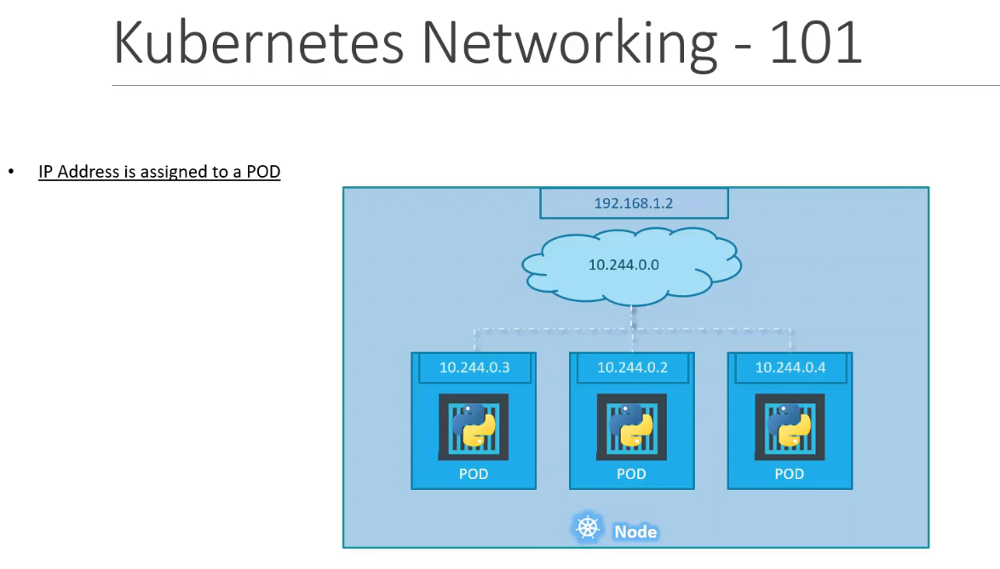
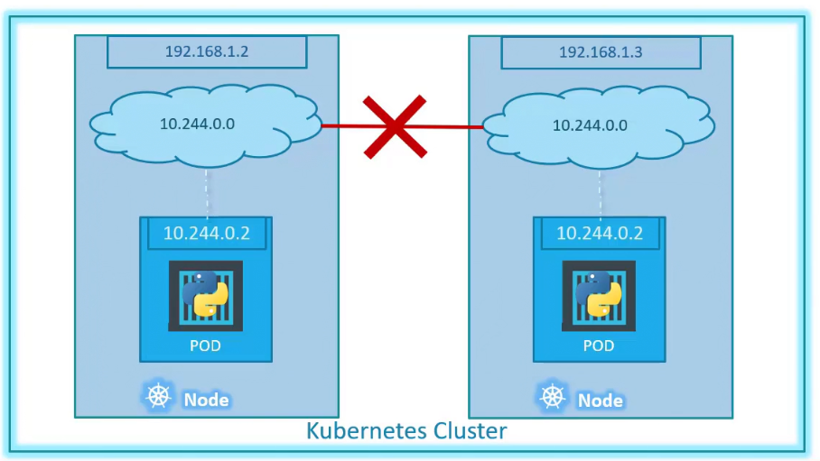
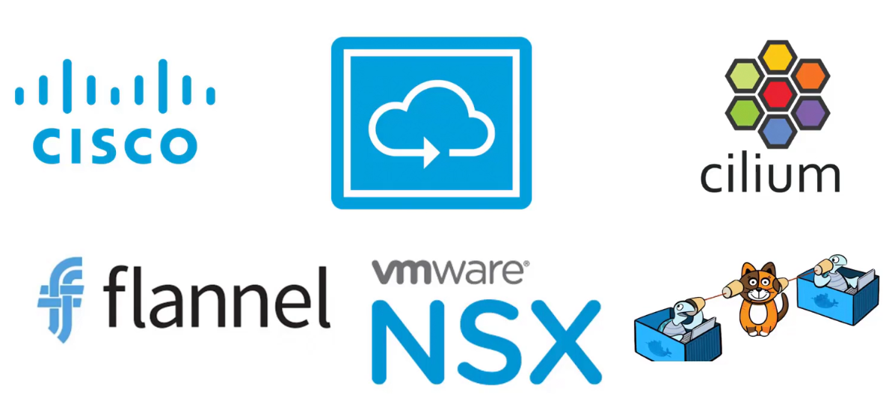
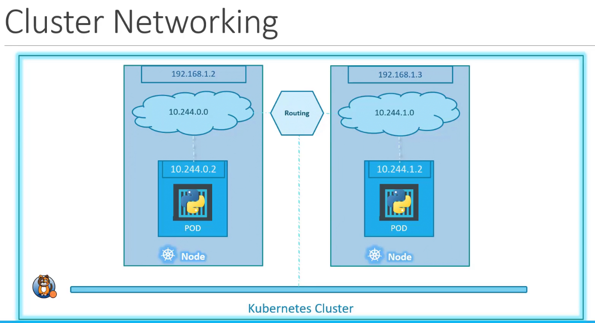

- Each node has an ip address
- The node has a pod which has a container
- An ip is also assigned to a pod
- Each node has an internal private network, and all pods in the node are attached to the network. When we deploy multiple pods, they all get a seperate ip assigned from this network. The pods can communicate to each other through this ip.

When we create a kubernetes cluster, if the internal network addresses of the nodes and if the deployed pods have the same address too. This would lead to IP conflicts.

When a kubernetes cluster is setup, it does not automatically set up any kind of networking to handle these issues. Kubernetes expects us to setup networking.

But these are solutions in markets which solve this for us. Depending on the platform we are deploying our cluster on we can use on of these solutions.

The custom networking solution manages the networks and IPs in the nodes and assigns a different network address for each network in the node. This creates a virtual network of all pods and nodes where they are all assigned a unique ip address

By using simple routing techniques, the cluster networking enables comunication the different pods or nodes to meet the networking requirements of kubernetes. All pods can now communicate with each other using the assigned IP address.

