# Kubernetes Services

Kubernetes Services enable communication between various components within and outside the application.
```
A service in Kubernetes provides a stable, network endpoint to expose a set of pods, enabling communication within or outside the cluster by abstracting dynamic pod IPs.

The service is like a virtual server
```

It helps connect applications together with other applications or users. Services enable connectivity between groups of pods.

For e.g. The front-end application is available to the end users through services and also communicates with the backend also via services. The backend also connects to the external data source through services.

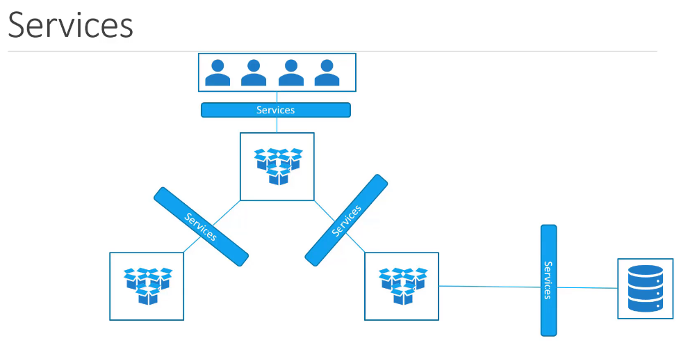

Services help in mapping the request from the user's laptop through the node to the pod running the container

The service is an object which listens to a port on the node and forward request on that port to a port on the pod running the application. This is known as a node port service.

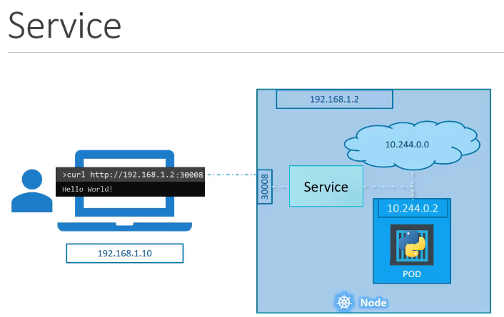

## Types of Services.
1. ClusterIP Service:

    The default service type, which exposes the service on an internal IP within the cluster. It is only accessible within the Kubernetes cluster.

2. NodePort Service:

    Exposes the service on each node's IP at a static port, allowing external traffic to access the service via <NodeIP>:<NodePort>. It enables limited external access.

3. LoadBalancer Service:

    Provisions a load balancer from the cloud provider and routes external traffic to the service, making it accessible outside the cluster. Commonly used in cloud environments.

4. ExternalName Service:

    Maps a service to an external DNS name, allowing Kubernetes to route traffic to services that are outside the cluster without managing them directly.


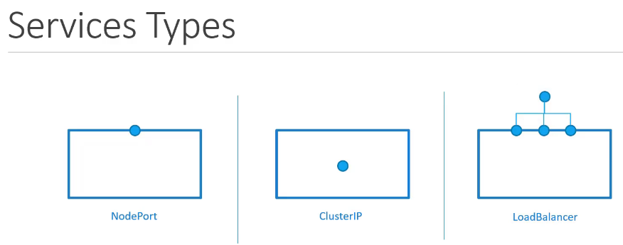


## NodePort Service
The request is forwarded to the target port.

The service is like a virtual server running inside the node. It has its own IP address. It is called the cluster IP of the service.

A definition file is used to create the service. The structure is same:
1. apiVersion
2. kind
3. metadata
4. spec

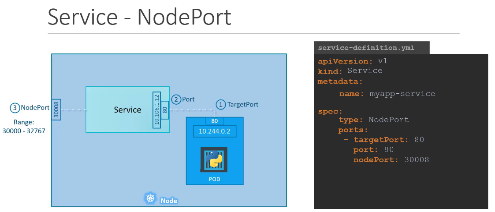

We use labels and selectors to link services and pods. Labels from pod definition file will be insterted into the selector section of the service definition file.

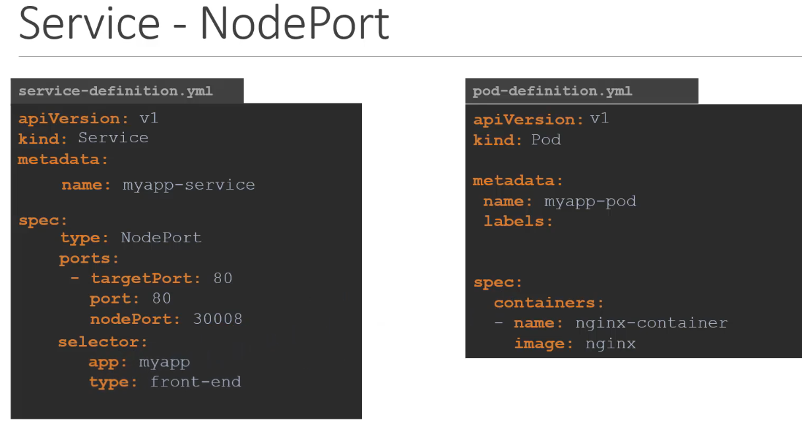

```
kubectl create -f service-definition.yml

kubectl get services                                    --list services
```

We can now use this port to access the web service using:

```bash
curl http://192.168.1.2:30008
```


## Service Mapped to multiple Pods
Service automatically sletcs the pods based on the selector in the definition file/labels of pods. It automatically balances the load using the Random Algorithm.

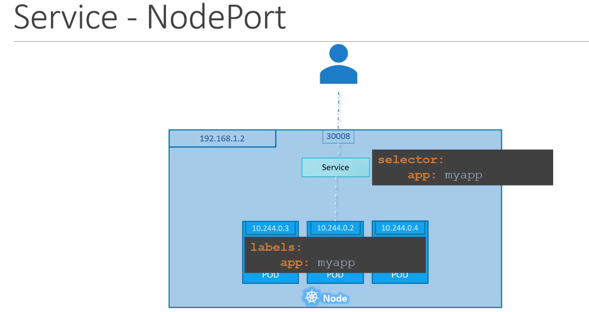

## Services Across Multiple Nodes

Kubernetes automatically creates a service that spans across all nodes in the cluster and maps the target port to the same node port on all the nodes in the cluster. This way we can access the application using the IP of any node in the cluster and using the same port number

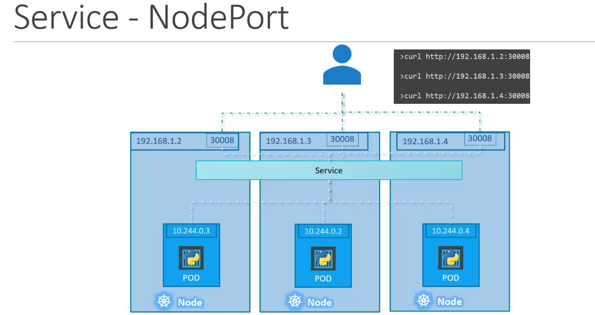

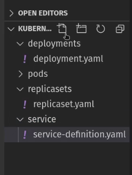


# ClusterIP
A full stack web application has multiple kinds of pods hosting different parts of an application.

Pods of each part would need to communicate with each other. The IPs of pods are not static as pods can go down and new pods can come up.

The service helps in grouping the pods together and provide a single interface to access the pods in a group.

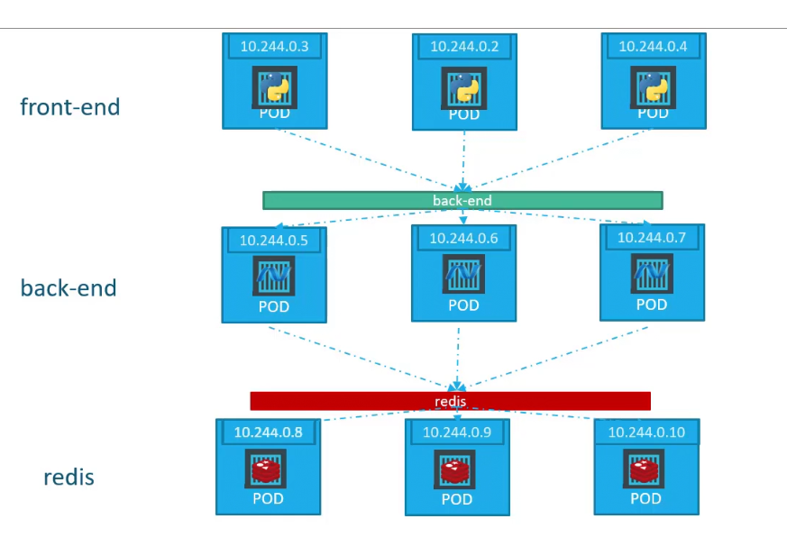

A service created for the backend pods will help group all the backend pods together and provide a single interface for other pods to access the service. The request are forwarded to one of the pods under the service randomly.

Each layer can now scale or move as required without impacting communication between the various services. Each service gets an IP and a name assigned to it inside the cluster. This type of service is known as clusterIP.

To create this type of service we use the service-definition file. In the selector we use labels from the pod-defintion.yml

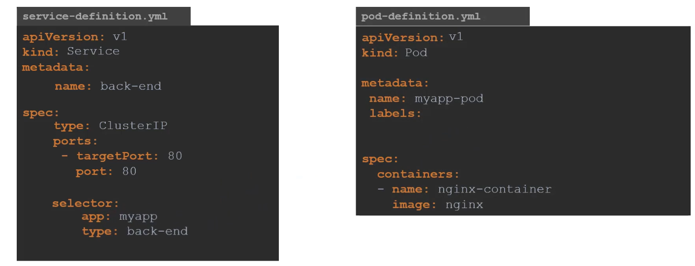

```
kubectl create -f service-definition.yml

kubectl get services
```

# Load Balancer Service

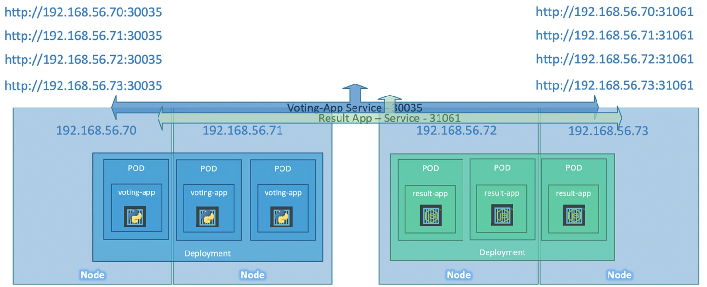

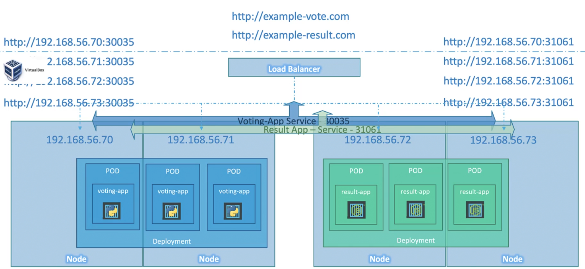

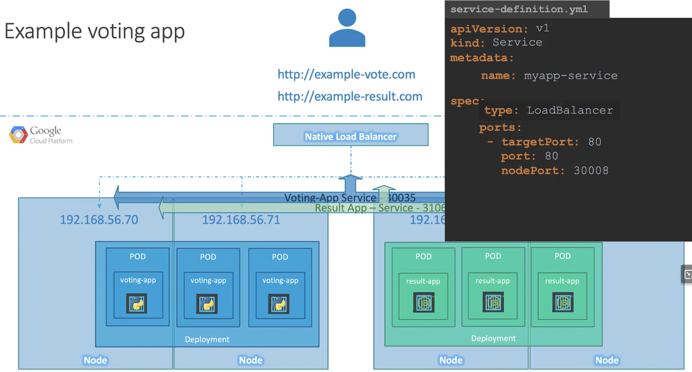

# Labs
1. How many services
```
kubectl get services            --1 service is created by default
``` 

2. What is the targetPort configured on the kubernetes service?