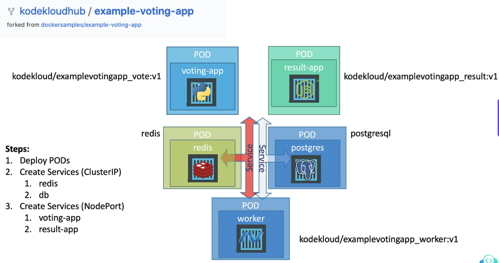

Steps:
1. deploy as pods
2. enable connectivity between the services
3. create service for user access

Deplying applications as just pods has its own challenges. Deploying the application as pods does not scale our applciation easily.

If we want to add more instances, or update the images/image then the application would need to be taken down. Deployment automatically creates replicasets.