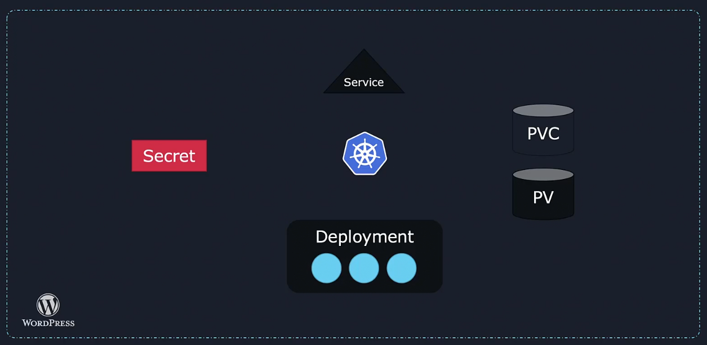
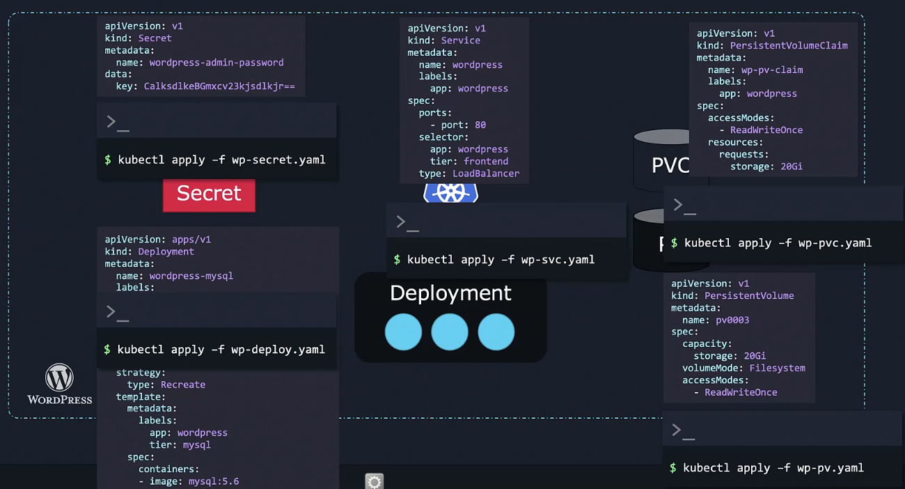
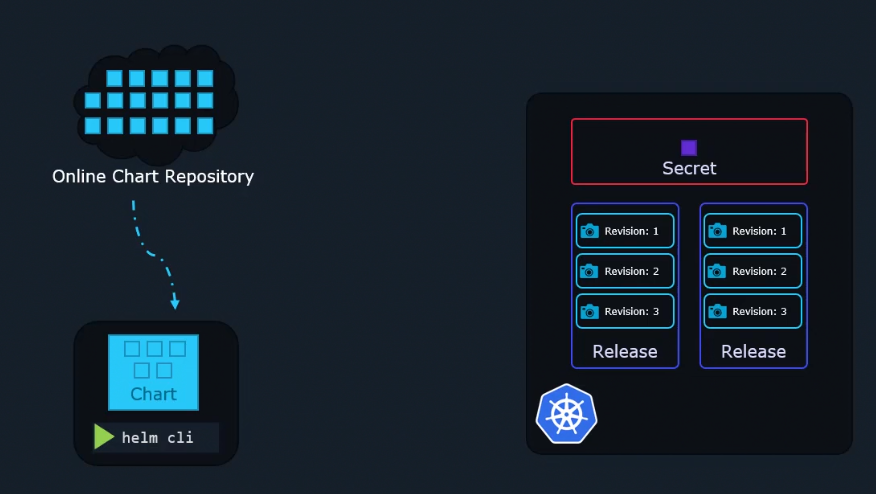
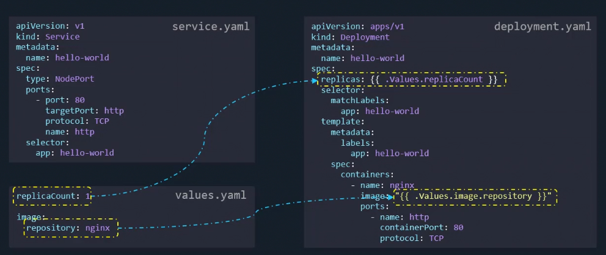
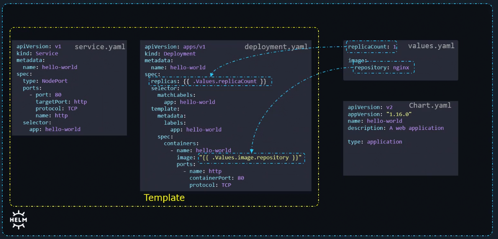
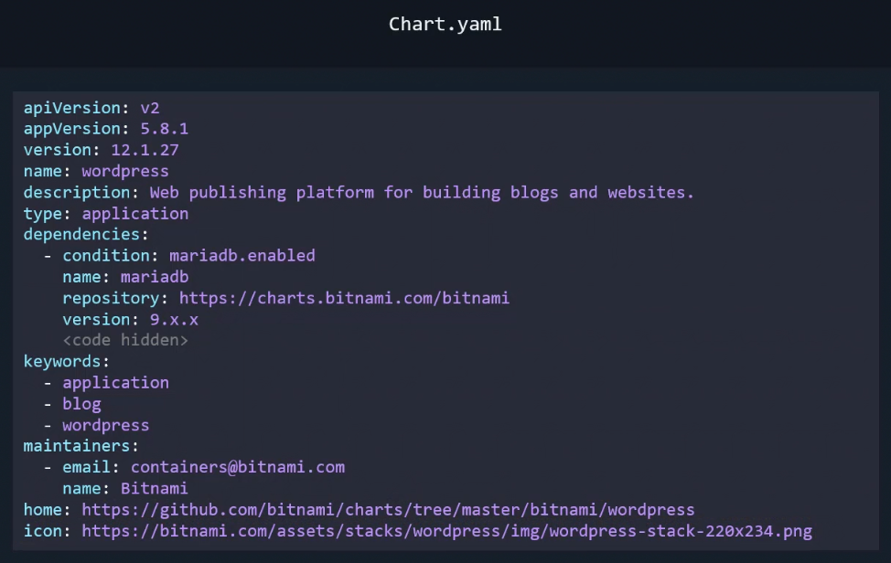
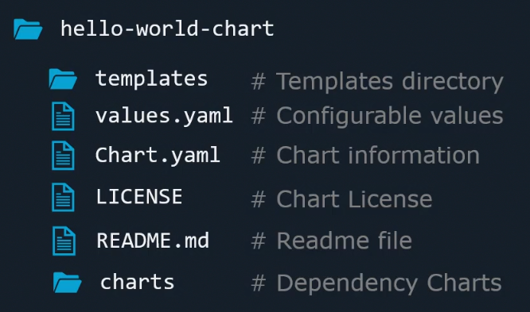
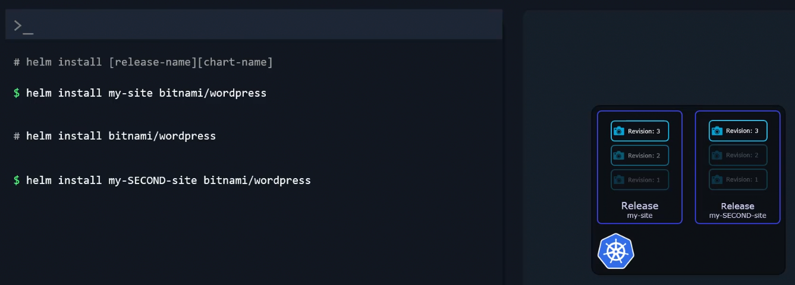

# Helm Introduction

Applications deployed into the kubernetes cluster can become very complicated.

A simple wordpress application would contain
- A deployment to deploy the pods which we want to run (e.g. web servers)
- A persistant volume to store the database(s)
- A service to expose the web service running in a pod to the internet
- Secret to store the credentials

all of them need to be interconnected to be used.



we would need a seperate yaml file for each object



Helm is a package manager for kubernetes. It looks for objects as part of a package at a group. We only tell helm the package we need to act on, and based on the package's name it knows what objects it should change and how.

We can customize the settings of our application by specifying desired values at install time. But instead of editing multiple values in multiple yaml files, we have a single location in which we can declare, every custom setting.

```
helm install wordpress

helm upgrade wordpress

helm rollback wordpress

helm uninstall wordpress
```

## Installing Helm

```
sudo snap install helm --classic

helm --help
helm verision
```

`--debug` for verbose output

## Helm Components
- Helm command line utility - perform actions such as installing charts, upgrading, rollbacks etc.
- Charts are a collection of files and contain all the instructions Helm needs to know to be able to create the collection of objects that we need in the kubernetes cluster
- By using charts, and adding the objects according to the specific instructions in the charts - Helm is essentially installing applications into the cluster.
- When a chart is applied in the cluster, a `release` is created which is a single installation of an application.
- Within each release we can have multiple revisions. Each revision is like a snapshot of the application i.e. everytime a change is made to the application such as an upgrade of image, change of replicas, configuration objects etc., a new revision is created.
- Like DockerHub, we can download publically available charts for various applications from Artifact Hub for deployment on our cluster.
- To keep track of what we did in our cluster such as releases that it installed, charts used, revision state, etc. - Helm saves this metadata in our kubernetes cluster as kubernetes secrets. 



## Helm Charts in detail
- Charts are a set of files and contain instructions that Helm needs in order to be able to create a collection of objects that you need in your kubernetes cluster. By using these charts Helm installs applications in our cluster
- In Helm, aside from deployment and service, `values.yaml` file is also created. This is because we dont build charts by ourselves as we have hundreds of them already available for download in a public repo. We configure the package which we installed through that chart - and values.yaml file is the file where the configurable values are stored. Mostly this is the only file which we need to customize the deployment of the application for or needs. Its like a settings file for the Helm Chart.
- Apart from the values.yaml file, there is also `Chart.yaml` file which contains information about the chart itself such as the chart api version, app version, name, description etc.





- apiversion tells about charts built for helm 2, 3 etc.
- There are 2 types of charts:
    - application
    - library
- A database which has its own helm chart is below listed as a dependancy.



## Structure of Charts directory



When a chart is applied to the cluster, a release is created

```
helm install <release-name> <chart-name>
```

Seperate releases can be tracked and changed independently. Each release is a completely sepearate and different entity eventhough they may originate from the same chart as releases.

Example use case: 
- We can have a release for a wordpress website that our customers use and a seperate release of a wordpress website which is only available to internal develoepers.
- The developers can experiment and add new features on the other website without breaking the main website.
- Since both websites are based of the same charts (are essentially clones), changes can be transferred to the main website in the exact same way.



- There are different providers hosting Helm repositories such as Appscode, Community operations, Truecharts, Bitnami etc.

All of these repositories have listed their charts in a single location known as the Helm Hub aka ArtifactHub.

Helm is essentially an automation tool.