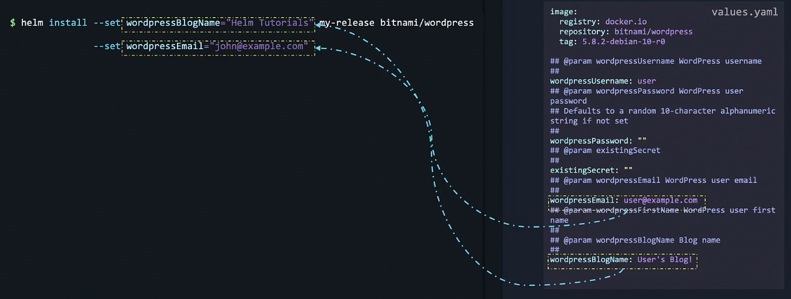
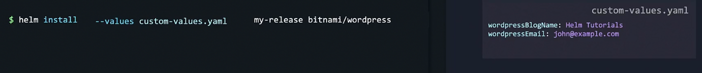

# Helm cli

All operations are run using the Helm CLI

```bash
helm --help
# Displays all available Helm commands with descriptions.

helm repo --help
# Shows available commands for managing Helm repositories.

helm search hub wordpress
# Searches Artifact Hub for Helm charts related to "wordpress".

helm repo add my-repo https://charts.bitnami.com/bitnami
# Adds a new Helm chart repository named "my-repo" from the specified URL.

helm install my-release my-repo/wordpress
# Installs the "wordpress" chart from the "my-repo" repository with the release name "my-release".

helm list
# Lists all Helm releases in the current namespace.

helm uninstall my-release
# Uninstalls the Helm release named "my-release".

helm repo
# Displays general information about Helm repositories.

helm repo list
# Lists all Helm repositories added to the Helm client.

helm repo update
# Refreshes the local cache of Helm charts from all added repositories.

```

## Custom parameters in the command line


In Helm, the `--set` flag is used to customize chart parameters directly from the command line. This allows you to override the default values in a Helm chart without modifying the chart files. This flexibility is particularly useful when deploying applications with configurations that vary across environments (e.g., development, staging, production).
Basic Syntax

The basic syntax for setting chart parameters with `--set` is:

```bash
helm install <release-name> <chart-name> --set key=value
```

## Examples
### 1. Setting a Single Parameter
To set a single parameter, such as changing the replicaCount for a deployment to 3:

```bash
helm install my-release bitnami/wordpress --set replicaCount=3
```
This overrides the default replicaCount with 3 for this release.

### 2. Setting Multiple Parameters

You can use `--set` multiple times to set different parameters:

```bash
helm install my-release bitnami/wordpress --set replicaCount=3 --set service.type=LoadBalancer
```
Here, the deployment has `replicaCount` set to 3 and `service.type` set to `LoadBalancer`.

### 3. Setting Nested Parameters

For nested parameters, use dot notation. For instance, to set the database user and password in a nested structure:

```bash
helm install my-release bitnami/wordpress --set mariadb.auth.username=myUser --set mariadb.auth.password=myPassword
```
This sets the mariadb.auth.username and mariadb.auth.password fields in the chart values.

### 4. Setting Arrays
Helm supports setting arrays using comma-separated values:
```bash
helm install my-release bitnami/wordpress --set tags[0]=frontend,tags[1]=backend
```
This sets an array tags with frontend and backend values.

### 5. Escaping Special Characters

If a value contains special characters (like commas, periods, or spaces), it should be quoted or escaped. For example:

```bash
helm install my-release bitnami/wordpress --set password="p@ssw0rd!"
```
### 6. Viewing the Resulting Values

To inspect the values used after setting custom parameters:

```bash
helm get values <release-name>
```
Using `--set` provides a convenient way to pass custom configurations on-the-fly, which is beneficial for dynamic deployments and quick customizations across environments.



### --values
If there are too many of these values, then there is an option to move these to our own `custom-values.yaml` file



## Helm pull

If we want to modify the built-in values.yaml file, Instead of running the `helm install` command, we break it up into 2 commands:
1. pull the chart using `helm pull bitnami/wordpress` - this pulls the chart in a compressed form. You could also run `helm pull --untar bitnami/wordpress`. Then we edit the values.yaml file.
2. After editing `helm install my-release ./wordpress`

Helm pull downloads a Helm chart to your local machine without deploying it. Whereas Helm install deploys (installs) a Helm chart to a Kubernetes cluster as a release.

## Adding helm chart repository in the controlplane node.

Adding a Helm chart repository to your Kubernetes control plane means setting up a source for (charts) that Helm can use. When you add, for example, the Bitnami repository, it gives you access to Bitnami’s charts so you can quickly deploy apps like Redis or MySQL on your cluster using simple Helm commands.

```bash
helm repo add my-repo https://charts.bitnami.com/bitnami
# Adds a new Helm chart repository named "my-repo" from the specified URL.

helm search repo bitnami/wordpress
# Which command is used to search for the wordpress package from the newly added bitnami repository?

helm repo list
# How many helm chart repositories are there in the controlplane node now?
```

Deploy the Apache application on the cluster using the apache from the bitnami repository. Set the release Name to: amaze-surf
```bash
helm install 
```

## Lifecycle management with Helm