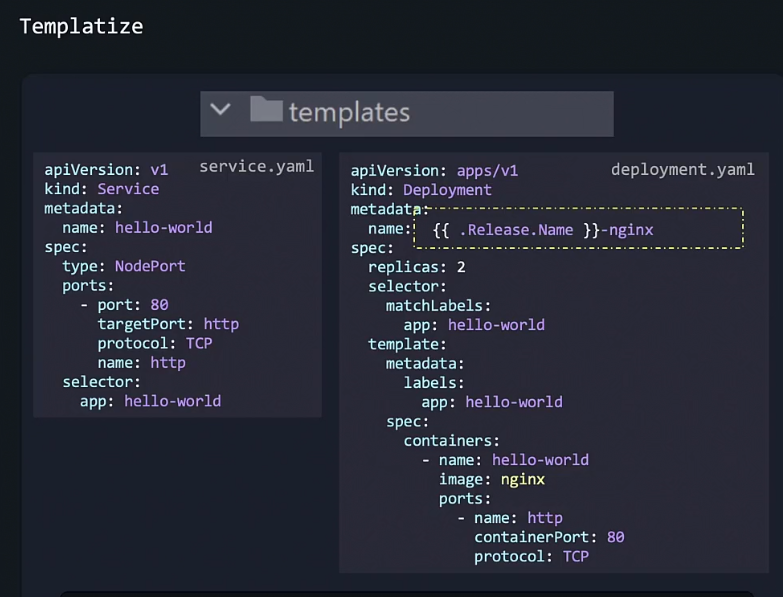
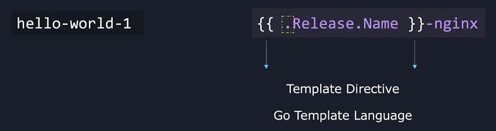
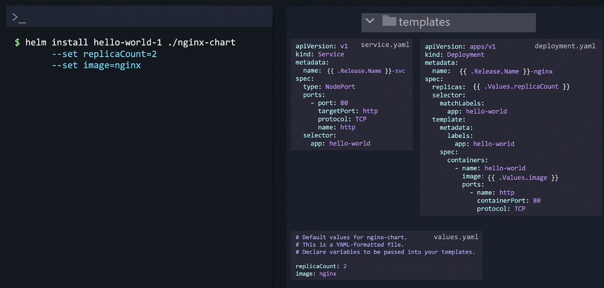
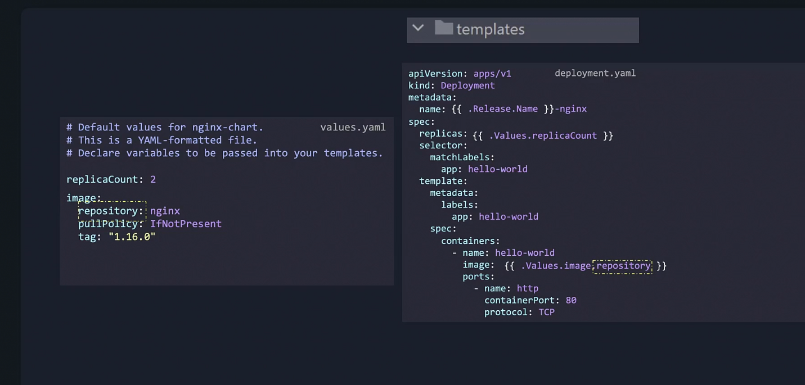
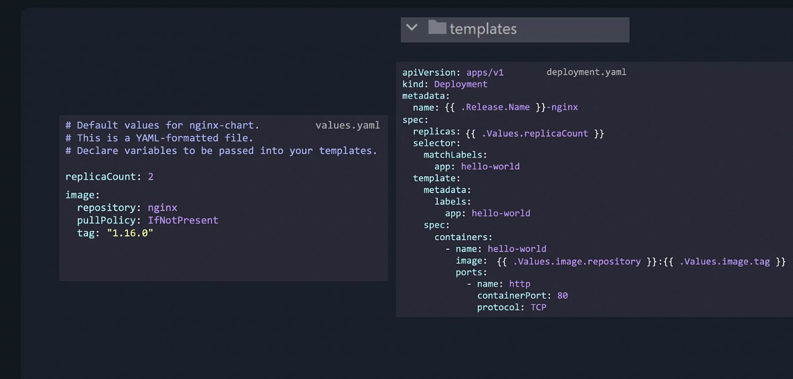

# Helm Charts
Helm charts can automate any kubernetes installation. They are like installation wizards of an OS.

Charts can act like programs, and besides installing, they can do other stuff also.

We can write our helm chart in such a way that whenever we do a helm upgrade, a database can be automatically backed up before that happens. We can do other type of stuff to.

## Creating a Helm chart from Scratch
1. deployment.yaml file
2. Service to expose the deployment.yaml file

To create a helm chart from this:
1. Create a directory structure first
```bash
helm create nginx-chart # creates skeleton structure of helm chart
```

We use helm templating language to tell helm that the name of this deployment should be based on how the user chooses to name the release.





Dot refers to the top level scope.

### Values

The values which we believe should not be hardcoded and should be templatized - we can allow the user to enter. We can enter

Anything defined as values should either be passed through the values option or the set option while installing helm chart, or in the values.yaml file.
```yaml
{{ .Values.replicaCount }}
{{ .Values.image }}
```







## Verify the chart is working as intended
There are 3 ways to do so:
1. Lint
2. Template
3. Dry Run

### Lint
Lint checks our chart is built without any formatting errors or wrong spellings values. It also tells best practices

```bash
helm lint ./nginx-chart
```
- To make sure the correct template would generate we can use the below command:
- `helm template ./nginx-chart` generates a chart template locally and displays the output. This output shows what each template file would generate 

- `helm template ./nginx-chart --debug` to see cause of error

### Dry run
Even after correct templating and generating template, sometimes we cant catch the error.
- For this we can use

```bash
helm install hello-world-1 ./nginx-chart --dry-run
```
This pretends to install the package to the cluster and can catch things which kubernetes would complain about in a real install but does not install anything.