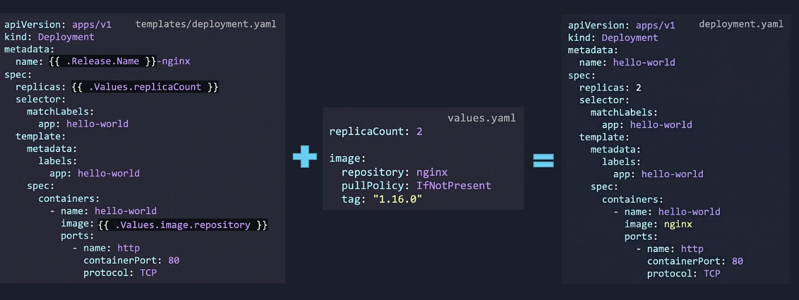
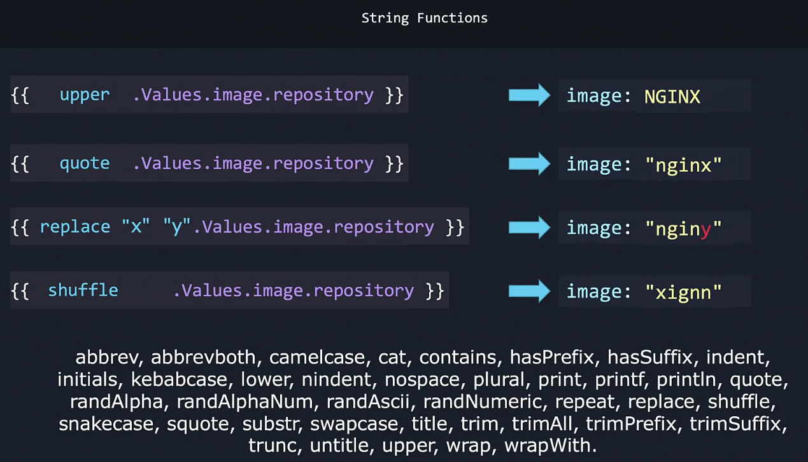
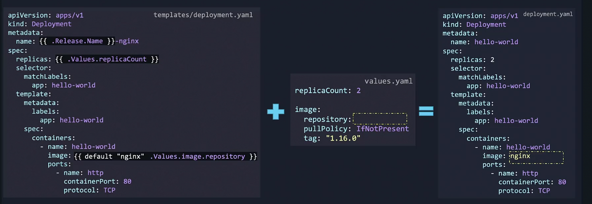
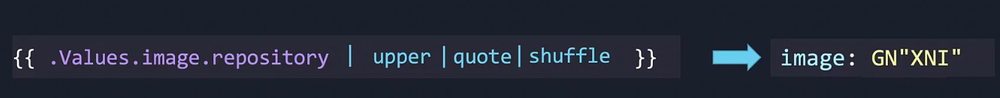

# Helm Functions
Template and values.yaml file create a valid manifest file i.e. deployment.yaml file.

If the repository name is not set in the values.yaml file, then the manifest file would be created without the image name. We can use Helm functions to set default values on which they can fall back onto in case the users dont provide anything in their values.yaml file.

- Functions in helm help transform data from one format to another.

Setting default value if user does not specify a value:

## Using pipes

