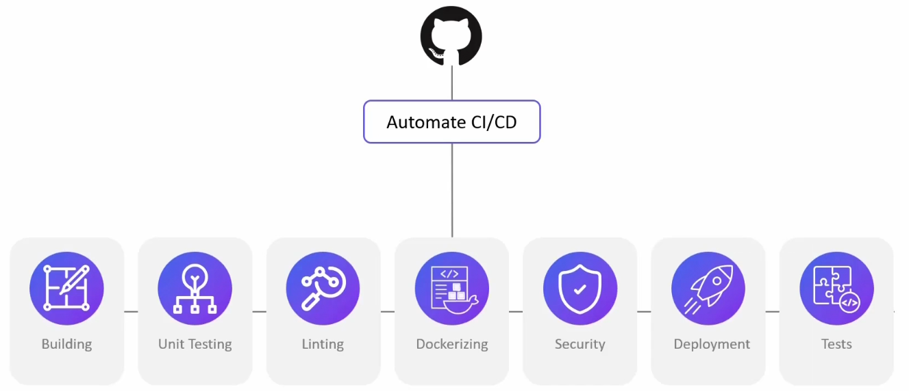
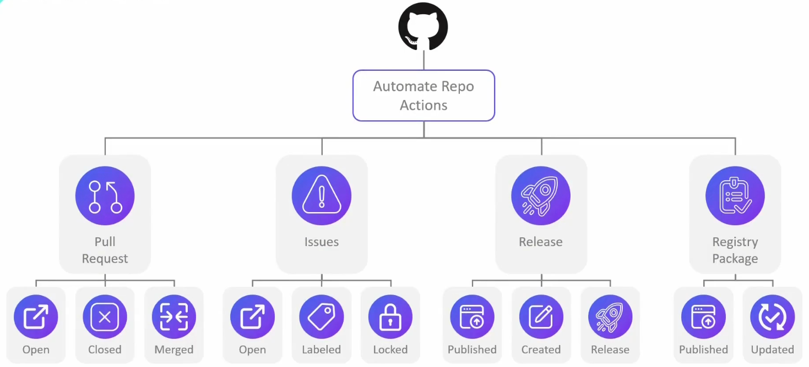
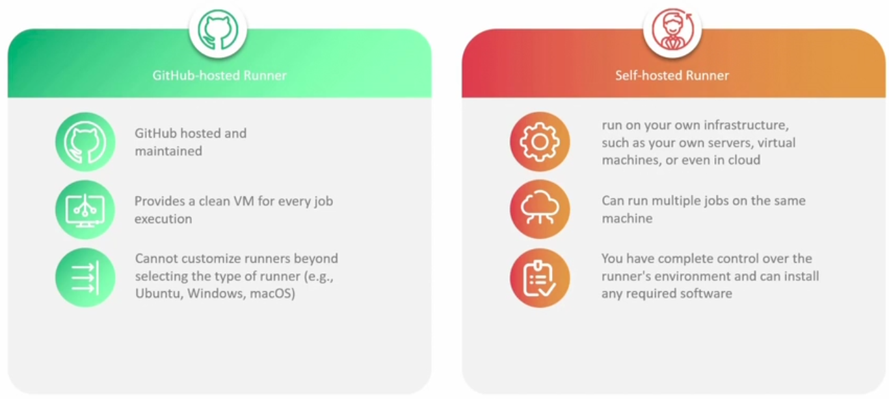
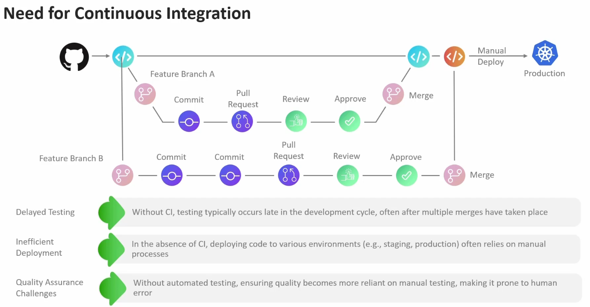
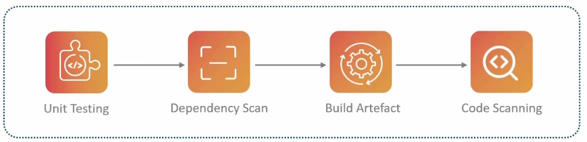
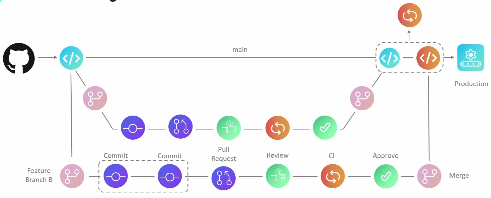
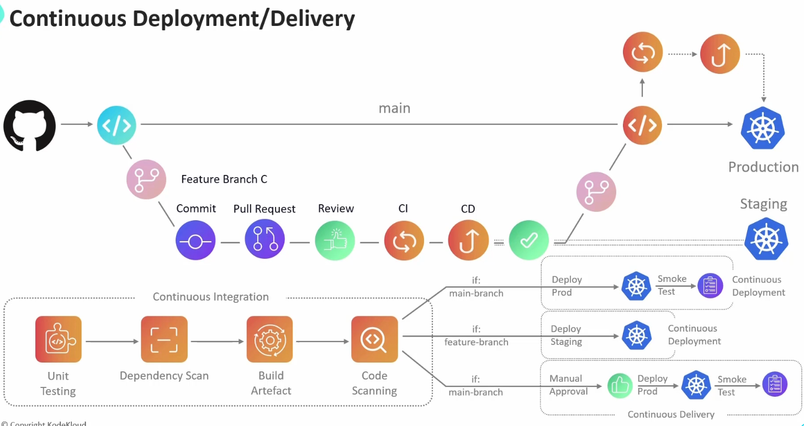

# Introduction to Github Actions

- Github Actions allows automation platform.
- Allows automation of tasks directly from repositories
- We can create a workflow to implement a CI/CD pipeline that build and test on every pull request and deploy merged pull request to production right beside the codebase.

**Advantages:**
- Infrastructure is managed by Github directly i.e. setup, scaling, and env.
- We only have to write workflow in yaml files
- Github also manages execution in VMs, caching dependancies and providing reports on outcomes.

## Besides CI/CD
- Besides CI/CD, Github Actions also allows to automate workflows when other events happen in the repository.
- It can automate repository actions by listening to events such as push events, issues, pull requests, etc.





## Workflow
A workflow is an automated process capable of executing one or more tasks. This is defined using a YAML file. and is located in the `.github/workflows` directory.

A repository can have multiple workflows each of which runs in response to a specific event occuring in the repository.

Example: Pushing code to the repository can trigger a workflow.

### Jobs
Within each workflow we define one or more jobs. A job consists of a series of individual steps which are executed on a runner.

A runner is a virtual machine which is responsible for executing your workflows upon triggering. Github automatically provisions runners for each job based on the runs on configuration specified at the job level.

## Runners
Types
1. GitHub hosted Runners
2. Self-Hosted Runners



# Basics of CI/CD
Source code is present in the Git Repo. Inside the repo the code is stored as well as versioned.

After the feature merge into the main branch, the code is then deployed either manually or through an automated process to production.

### Without Continios integration

1. **Delayed Testing**: Testing is postponed until later stages, causing potential issues to remain undiscovered for longer periods.
2. **Inefficient Deployment**: Manual deployments increase the risk of errors and slow down the release process.
3. **Quality Assurance Challenges**: Without continuous integration, maintaining consistent code quality and detecting bugs early becomes difficult.



### Components of a CI pipeline

```
The porcess which enables multiple developers to work on the same application, while ensuring that these new changes integrate smoothly is called Continuous integration. (Without affecting the existing code)
```

All of the below assesments are performed on both the newly added code and the existing code from the main branch. If any of the test fails, developer needs to make changes and commit the changes the same pull request, which would trigger the CI pipeline once again.



Any merges into the main branch is again going to trigger a CI pipeline.



## Continuous Delivery
Previously, after the code integration into the main branch, we manually deployed it into the production enviroment. 

So after CI it is advisable to deploy the modified applications into a non-production environment that closely resembles the live environment. This allows for live testing before proceeding with production deployments.

```
The continuous deployment pipeline is responsible for modifying the modified code to either a staging or development environment.
```

After deployment a series of tests are conducted to ensure the quality of application is not regretted.

After completion of CD the pull request is then approved and merged back into the main branch. Within the main branch the CI pipeline is triggered assesing the newly merged changes, and if successful it initiates a CD pipeline resulting in the deployment of the application to the production environment. 


