There are multiple ways of interacting with aws

1. Console, web gui - slow process
2. CLI - faster
3. SDK - code to manage aws resources

```
aws.amazon.com/console
```

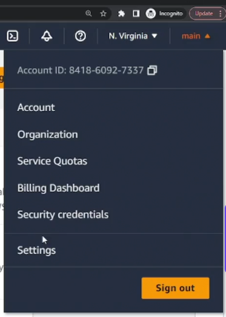

The below drop down tells in which region we are working with aws i.e. where we want our resources to be deployed. Some services are global

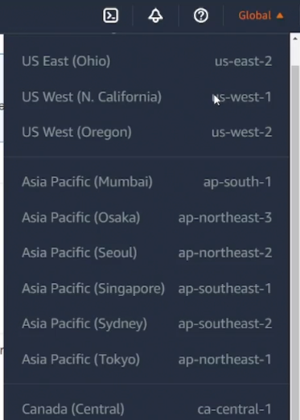

### AWS CLI

Read documentation to install cli
```
aws.amazon.com/cli

https://docs.aws.amazon.com/cli/latest/userguide/getting-started-install.html
```

To install the AWS CLI, run the following commands.
```bash
curl "https://awscli.amazonaws.com/awscli-exe-linux-x86_64.zip" -o "awscliv2.zip"
unzip awscliv2.zip
sudo ./aws/install
```

To check aws cli is installed

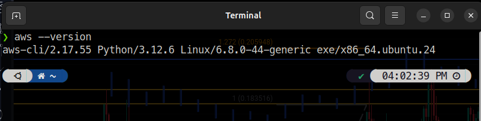


### Setting up AWS CLI
Trying to setup an s3 bucket

```bash
aws s3 help
aws s3 mb "s3://my-bucket"
```

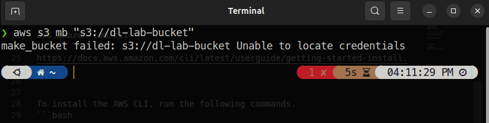

#### Setting up Credentials

We never setup credentials using the root account. It is best practice to create a new IAM account everytime setting up new credentials/device. If any device gets compromised we can restrict access.

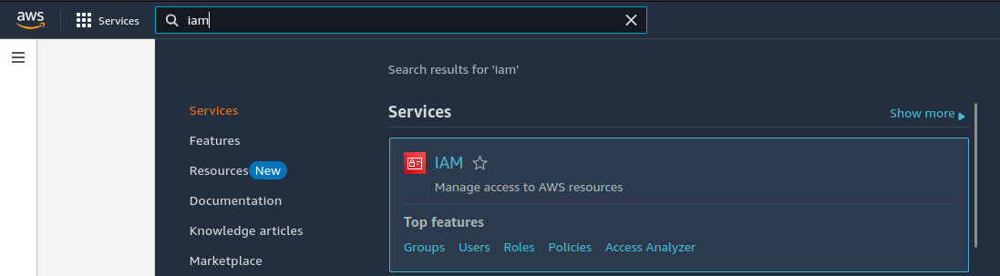

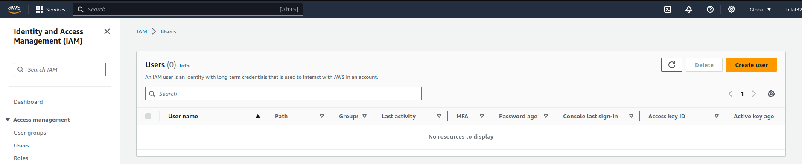

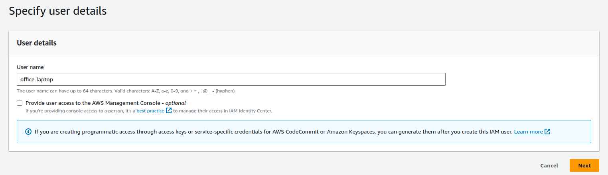

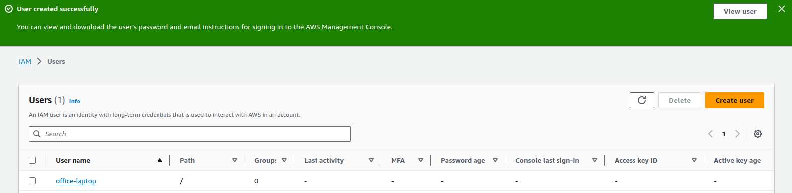

Click the user and create access key

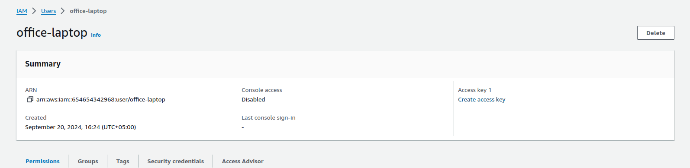

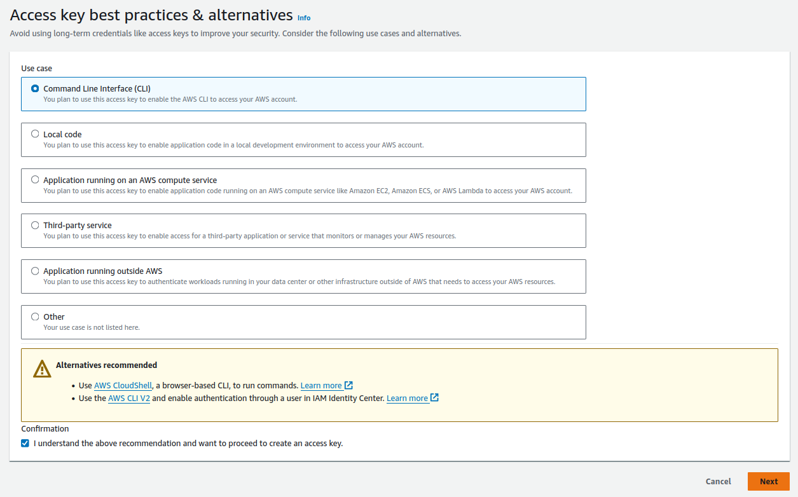

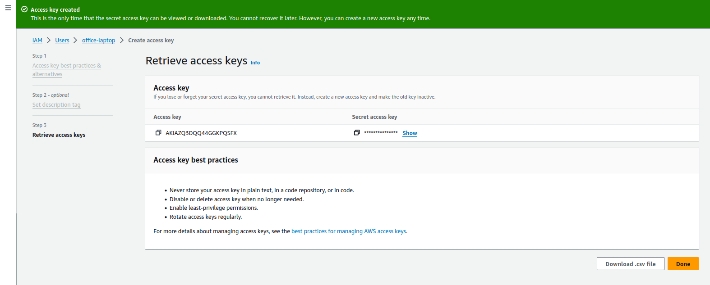

Save both access key and secret access key.


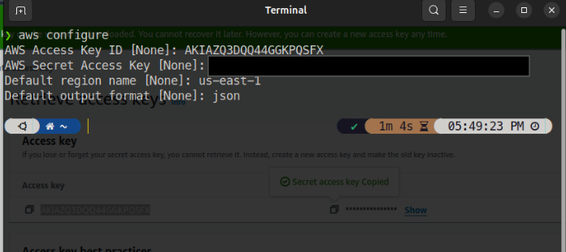

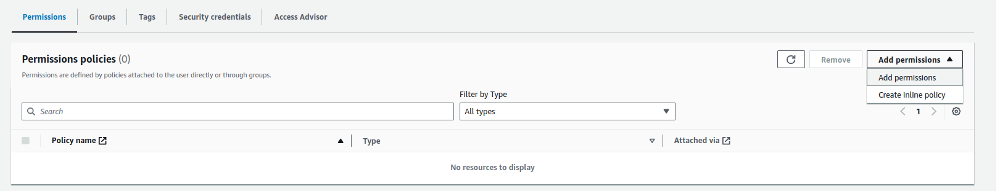

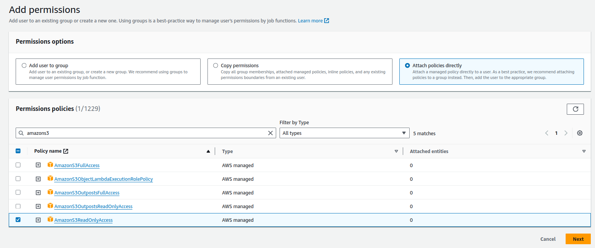

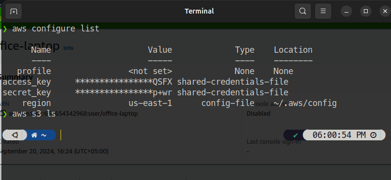

---
