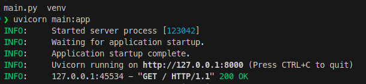
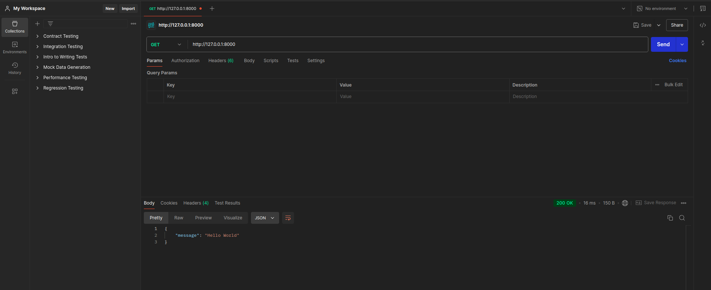
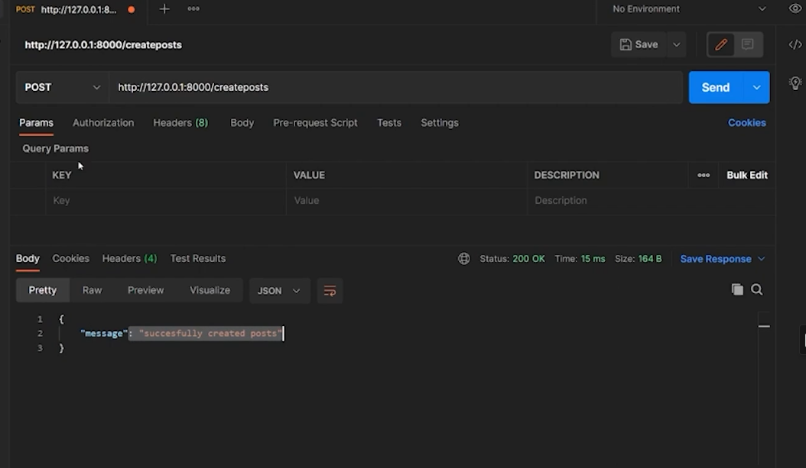
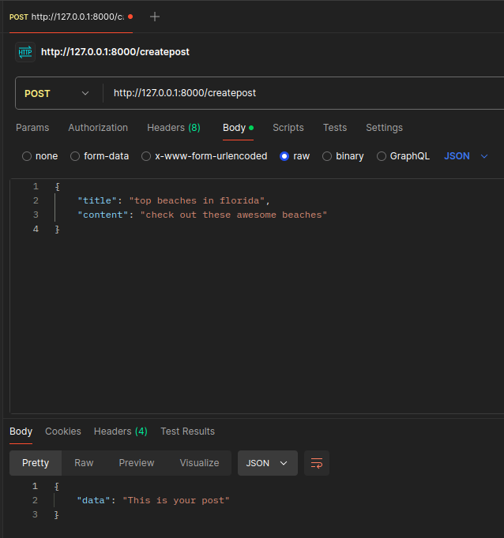
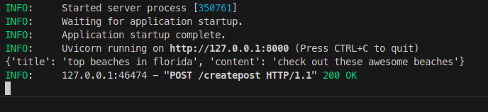
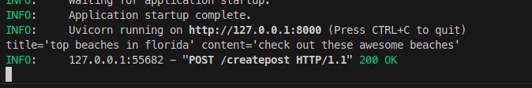
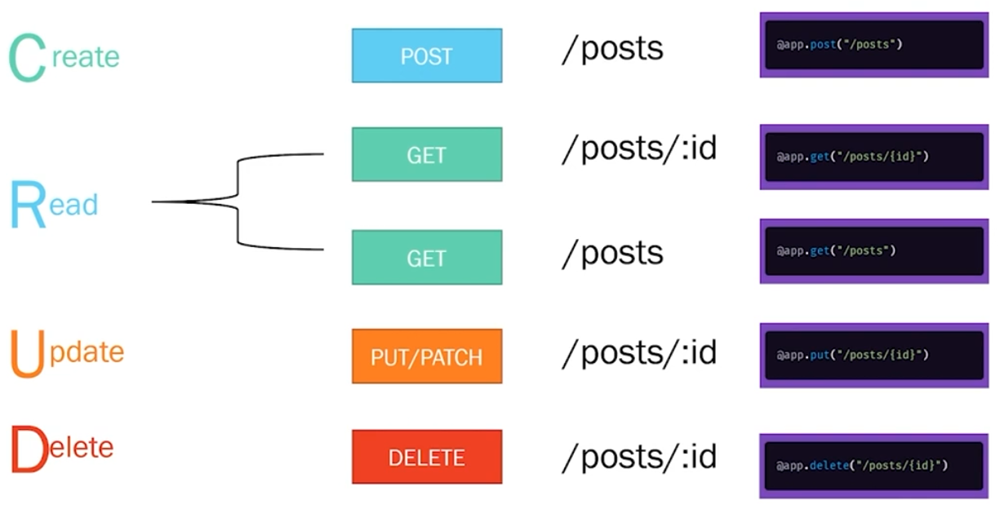
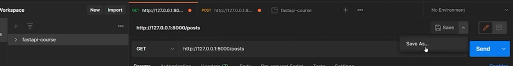
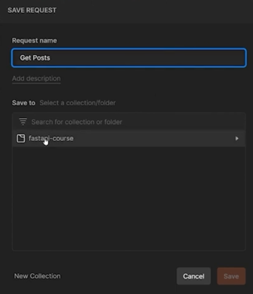

# Venv Basics
```bash
python3 -m venv <venv-name>
source venv/bin/activate            #enable venv for terminal
```
### Change interpretor:
`view` -> `command pallete` -> `python select interpretor` -> `enter inerpretor path` -> `./venv/bin/python`

```
pip install fastapi
pip freeze

pip install uvicorn
```

### main.py
```python
from fastapi import FastAPI

app = FastAPI()

# path operation
@app.get("/")       # this decorator converts this function to a path operation in the url to access
async def root():
    return {"message": "Hello World"}

@app.get("/post")
async def post():
    return {"data": "This is your post"}
```

### Starting the web server
```bash
uvicorn <file-name>:<fast-api-instance>
uvicorn main:app
```


## Postman
To test an api we dont need to build an entire front end for it. Postman is used for testing APIs. It allows to construct http requests.





##  Post requests
with post request we can send data to the api server - for creating things. Then API server will then send back some data (I have created a post).

```python
@app.post("/createpost")
async def createpost():
    return {"data": "This is your post"}
```



#### Sending data in the body of the post request

Go to body in postman
Body -> raw -> JSON (standard)



#### Extracting data of the body in the code

In the path operating function, we input payload/body of type dict and assign it to **Body**

It is going to extract all of the fields from the Body and convert it into a python dictionary and store it inside a variable named payload.

We are taking the body and converting it into a dictionary and storing it into payload.

```python
from fastapi.params import Body

@app.post("/createpost")
async def createpost(payload: dict = Body(...)):
    print(payload)

    return {"data": "Succesfully created posts"}
```



## Schema Validation using Pydantic
- This is done to validate the data i.e. the user is sending what i want 
- We explicitly define what the data should look like
- We use pydantic to define what our schema should look like.

First we define a class indicating what a post should look like

```python
from pydantic import BaseModel

class Post(BaseModel):
    title: str
    content: str


@app.post("/createpost")
async def createpost(payload: Post):
    print(payload)

    return {"data": "Succesfully created posts"}
```
Since we passed our pydantic model `Post` into our operation, FastAPI is automatically going to validate the data which it recieves from the client. `title` and `content` are mandatory



Using pydantic we can also extract individual properties.

### Default / optional values

```python
from pydantic import BaseModel

from typing import Optional

class Post(BaseModel):
    title: str
    content: str
    published: bool = True
    rating: Optional[int] = None
```

- Here published is an optional field, if the user does not provide it, it will default to true.
- rating is an optional field, if not provided it will default to None i.e. wont save any data. 

To convert a pydantic model to a dictionary:
```python
payload.dict()
```

# CRUD applications and best practices
Create Read Update Delete

CRUD is an acronym which represents main functions of an application.



- There are standard conventions when creating an API for a CRUD based application.
- There is a standard convention for naming URL and paths for each operation.
- use plural form of posts
- For reading we are going to create 2 different path operations:
    - For reading all operations
    - For reading posts based on filters
    - `/posts/:id` is for getting one individual post

### Update
Updating a pre-existing post. We have 2 options:
1. Put - You pass all of the information (all fields) for updating it.
2. Patch - You only pass the specific field which you want to update.

### Storing data

Create a variable 

```python
# an array which is going to contain post objects
my_posts = [
    {
        "id": 1,
        "title": "Story about florida",
        "content": "bla bla bla bla",
    },
    {
        ...
    }
]


@app.get("/posts")
def get_posts():
    return {"data": my_posts} # the array is going to get serialized into json

from random import randrange

# saving
@app.post("/posts")
def create_posts(post: Post):
    
    post_dict = post.dict()
    post_dict["id"] = randrange(0, 100000)

    my_posts.append(post_dict)
    return {"data": post_dict} # we send the newly created post
```

## Saving Collection in Postman


Name the collection


Save the api to a collection





Api now in collection


### Getting a single post

```python
@app.get("/posts/{uid}")
def get_post(id):
    ...

```

## Response Status

```python
from fastapi import Response, status
from fastapi import HTTPException

@app.get("/posts/{id}")
def get_post(id, response):
    post = find_post(id,)

    if not post:
        raise HTTPException(status_code = status.HTTP_404_NOT_FOUND,
                            detail= f"post with id: {id} was not found"
                                )
    #     response.status_code = status.HTTP_404_NOT_FOUND
    #     return {"message": f"post with id: {id} was not found"}
```

## Deleting a post


```python
@app.delete("posts/{id}", status_code=status.HTTP_204_NO_CONTENT)
def delete_post(id):
    index=find_index_post(id)
    my_posts.pop(index)
    return Response(status_code=status.HTTP_204_NO_CONTENT)
```

- To see the documentation:
```python
localhost:8000/docs
```

# Structuring the code
- python has a concept of packages, which is just a folder
- for something to act as a package, it needs a dummy file `__init__.py`
```python
-app
-- __init__.py
-- main.py

uvicorn app.main:app --reload
```