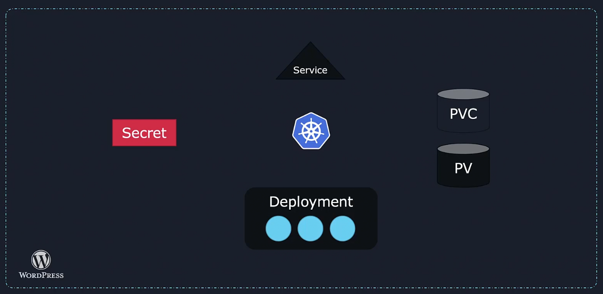
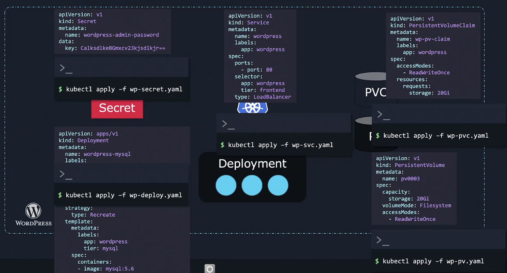

Applications deployed into the kubernetes cluster can become very complicated.

A simple wordpress application would contain
- A deployment to deploy the pods which we want to run (e.g. web servers)
- A persistant volume to store the database(s)
- A service to expose the web service running in a pod to the internet
- Secret to store the credentials

all of them need to be interconnected to be used.



we would need a seperate yaml file for each object



Helm is a package manager for kubernetes. It looks for objects as part of a package at a group. We only tell helm the package we need to act on, and based on the package's name it knows what objects it should change and how.

We can customize the settings of our application by specifying desired values at install time. But instead of editing multiple values in multiple yaml files, we have a single location in which we can declare, every custom setting.

```
helm install wordpress

helm upgrade wordpress

helm rollback wordpress

helm uninstall wordpress
```

## Installing helm

```
sudo snap install helm --classic

helm --help
helm verision
```

`--debug` for verbose output