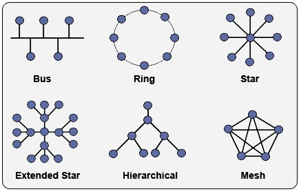
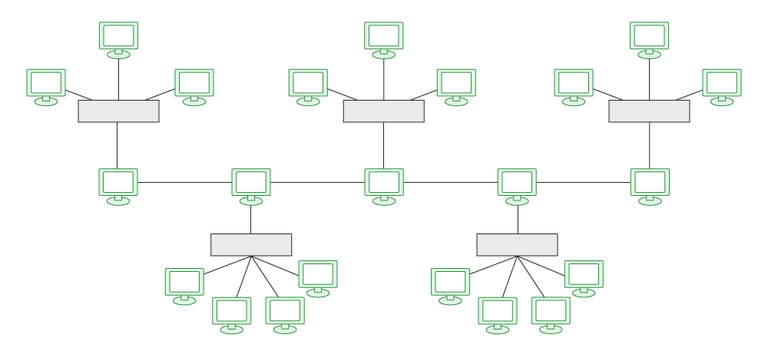
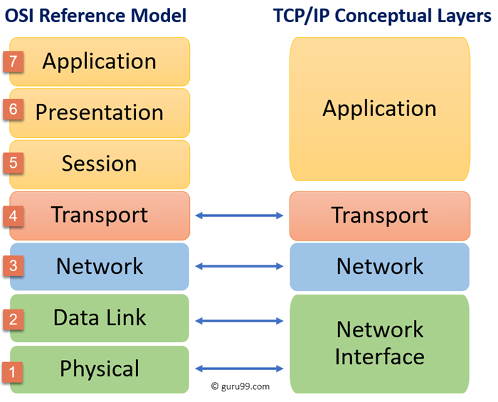

# Networking Crash course
- Protocol: Rule which defined how is data being sent is known as protocol
- TCP: Transmission control protocol - it will ensure that the data will reach its destination and will not be corrupted on the way
- UDP: User Datagram protocol not all data is reached e.g. vdeo calling
- HTTP: Hyper-text Transfer protocol. Used by web browsers. defines the format of the data which is being websites - clients and servers 

- Files are always sent in chunks (packets)
- Servers are identified using IP addresses

```bash
curl ifconfig.me -s
```
## Ports
- Ports are 16 bit numbers - so total port numbers which are possible are 2^16.
- Web pages use http. All http stuff happens at port `80`.
- Port for mongodb is 27017.
- ports 0 to 1023 are reserved ports
- ports 1024 to 49152 are registered for applications like mongodb and mysql etc.
- 1 MBPS means 1 mega bits per second.

## Types of Networks
**_LAN:_** For a small house / office. Network adapter is used or wifi

**_MAN:_** Metropolitan area network across a city

**_WAN:_**  Wide area network across countries using optical fibre cables.

- Internet is a collection of all 3 above.
- A lot of LANs are connected to each other using MAN, which are connected to each other using WANs.

1. SONET - synchronous optical networking. carries data using optical fibre cables, hence can cover larger distances.
2. Frame Relay - connect LAN to WAN

## Modem & Router
- Modem is used to convert digital signals into analogue (electrical) signals and vv.
- Router - routes the data packets based on their ip addresses.
- IP address is the phone book of the internet. ISP are companies which provide access to the internet. Tier 2 ISP providers take internet from Tier 1 ISP providers.

## Topologies


1. In **Bus** if main link gets broken, it will spoil the entire network. Also only 1 person can send data at a time.
2. **Ring** - every system communicates with one another. But again if cable breaks then we wont be able to transfer data. Also lot of unnecessary calls are being made. A to F will have to go to B and C.
3. In **Star**, if central device fails, everything will go down.
4. **Mesh** - Every computer is connected to every other computer - Expensive and not scalable.
5. **Bus Star Topology:**



----
## Structure of the Network
### 1. OSI MODEL (Theoretical)

OSI - Open systems inter connection model. How servers should communicate with each other. 7 layers.

- ALL `APPLICATION LAYER`
- PEOPLE `PRESENTATION LAYER`
- SHOULD `SESSION LAYER`
- TRY `TRANSPORT LAYER`
- NEW `NETWORK LAYER`
- DOMINOS  `DATALINK`
- PIZZA `PHYSICAL LAYER`



- Presentation layer takes data from application layer and converts it into machine representable binary format. It is also compressend and abstracted. SSL protocol is used for this.
- Session layer helps in setting up and managing connections. It enables sending and recieving of data folloowed by termination of connected sessions. Before a session is established, authentication is done. Authorization is also done.
- Data recieved from the session layer is divided into small parts called segments. `Every segment will contain the source and the destination's port number and a sequence number`.
- Sequence number helps in reassembling of segments in correct order.
- Network stage is about communicating with the external network - Router lives here. This stage is responsible for logical addressing. Network layer assigns the senders and recievers IP address to every segment and it forms an IP packet so that every data packet can reach the correct destination. It also performs routing - moving data packet from source to destination.
### Data Link layer
- Physical addressing is done at the data link layer (MAC addresses)
- Data link layer allows to directly communicate with the computers and hosts. This layer will recieve the data packet from the network layer.
- This data packet contains the IP addresses of both the sender and the reciever.
- Computer A of ip of 192.168.1.1 (sender) is connected to the wifi, which sends a message to facebook whose server will have IP of 192.168.3.1 (reciever)
- Every packet contains 3 things:
    1. Sender's IP address
    2. Reciever's IP address
    3. Subnet mask
- MAC addresses of the sender and reciever are assigned to the data packet to form a frame.
Internet is very complex and OSI model is 